# 영상통화 / 모니터링 시나리오 다이어그램

Family ↔ Senior WebRTC 통화 · 모니터링 · ICE restart 전 시나리오.

> 시그널링 채널: Firebase RTDB `/calls/{callId}/`
> 구현 경로: [webrtc_service.dart](../lib/services/call/webrtc_service.dart), [signaling_service.dart](../lib/services/call/signaling_service.dart)

---

## 1. FSM 전체 상태 다이어그램

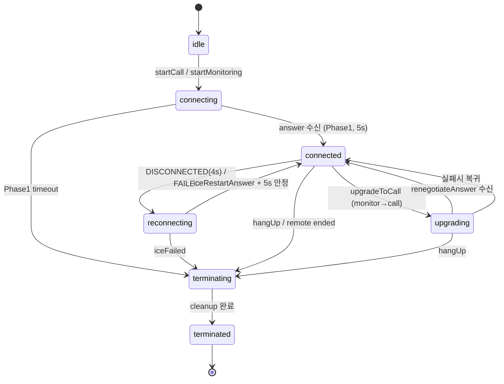

---

## 2. 양방향 통화 발신 — Phase 1 (벨 울림)

Senior 앱이 offer를 받고 answer를 돌려주는 단계. 5초 타임아웃.

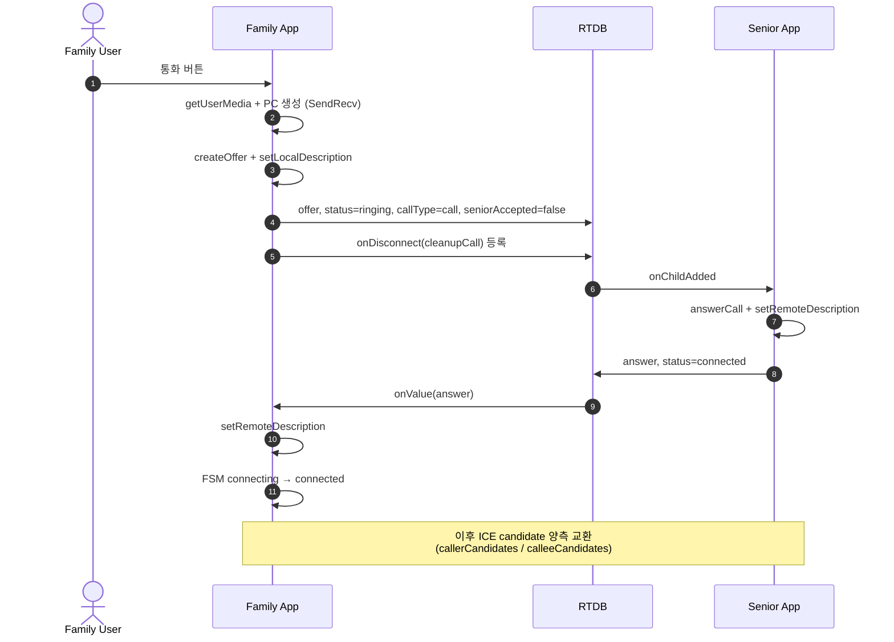

Phase 1 timeout → `unreachable` (Senior 미실행/오프라인).

---

## 3. 양방향 통화 발신 — Phase 2 (실제 수락)

Senior 사용자의 얼굴감지 또는 수동 수락. 20초 타임아웃.

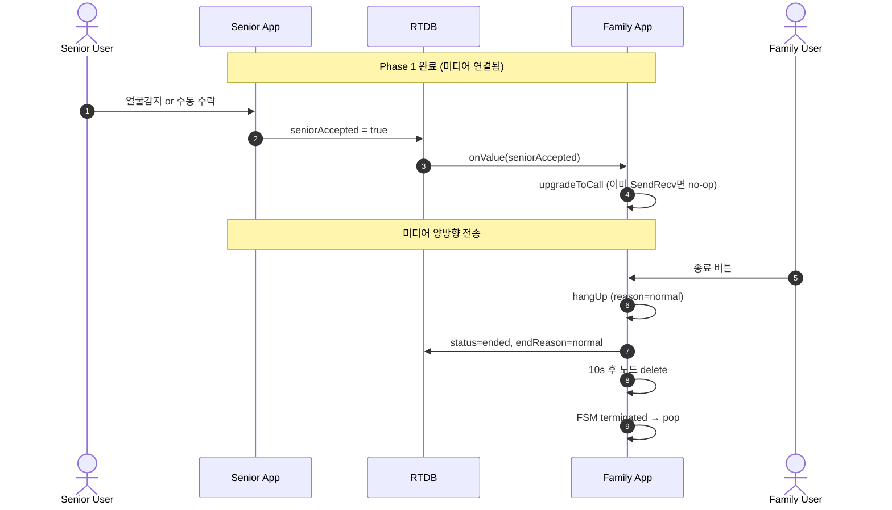

Phase 2 timeout → `noAcceptance` (벨은 울렸으나 응답 없음).

---

## 4. CCTV 모니터링 (callType=monitor)

Family는 로컬 미디어 없이 Senior 영상만 수신 (RecvOnly).

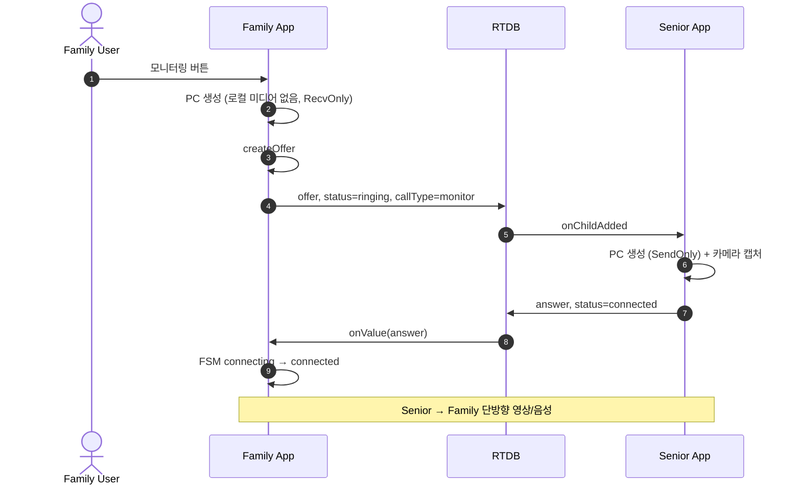

---

## 5. 모니터링 → 통화 전환 (upgradeToCall)

RecvOnly 상태에서 사용자가 "통화 전환" 버튼 누르면 renegotiation 수행.

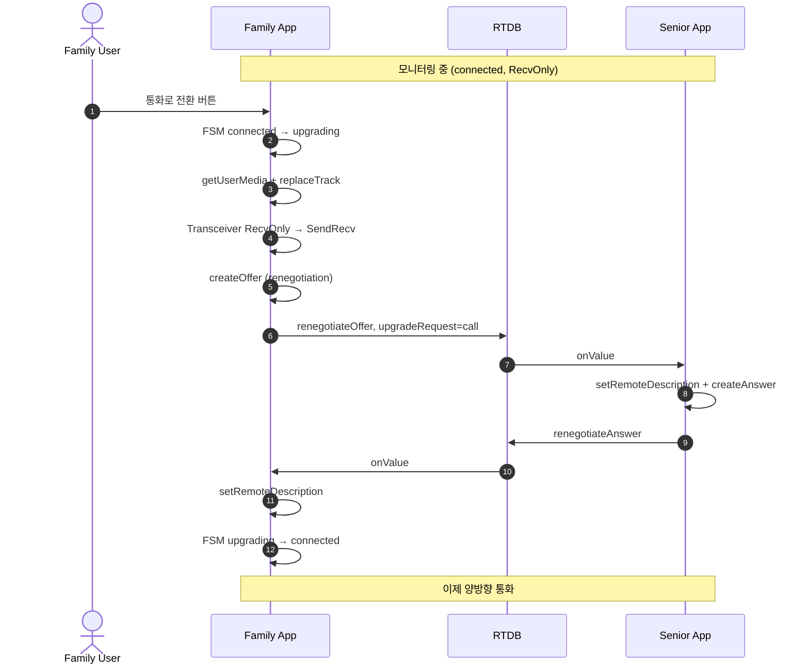

실패 시 monitor 상태로 복귀.

---

## 6. ICE Restart — 정상 복구

네트워크 전환(Wi-Fi↔LTE), NAT rebinding, 일시 단절 시 자동 복구.

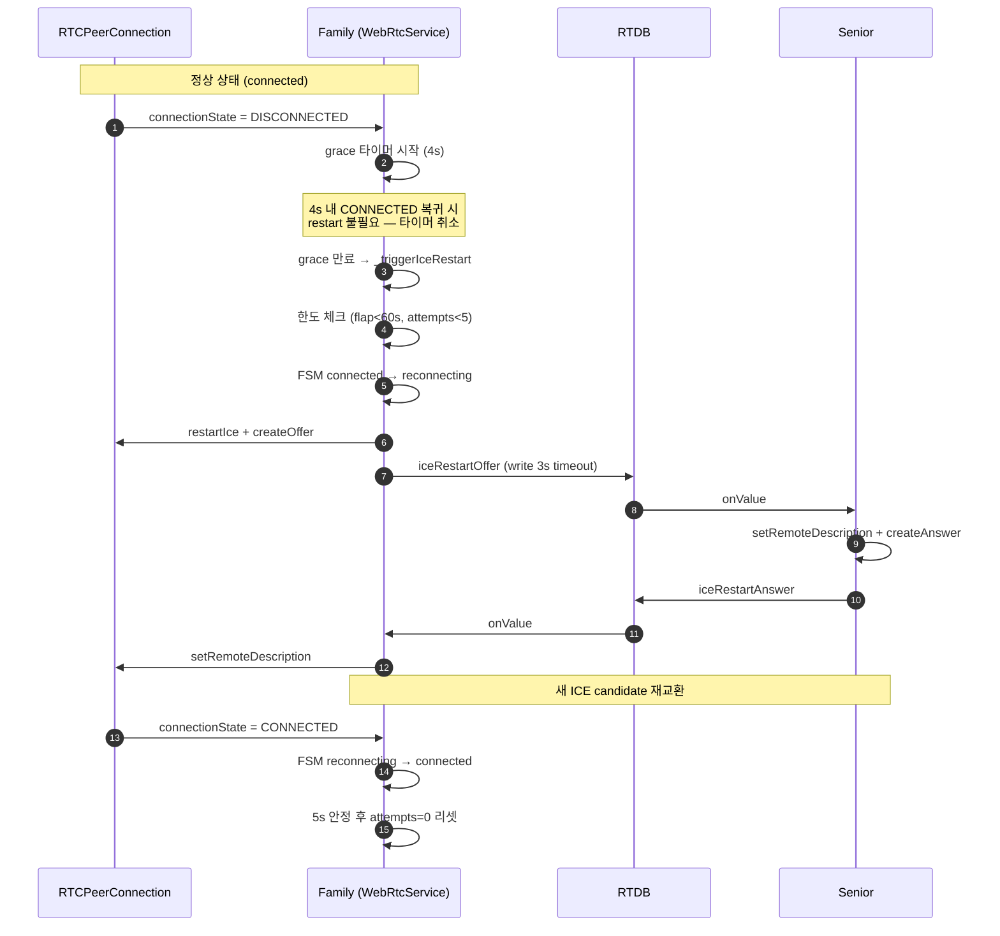

**FAILED 상태는 grace 없이 즉시 restart 트리거**.

---

## 7. ICE Restart — 한도 초과 / 실패

answer 미수신 자동 재시도, 최종 실패 시 iceFailed 종료.

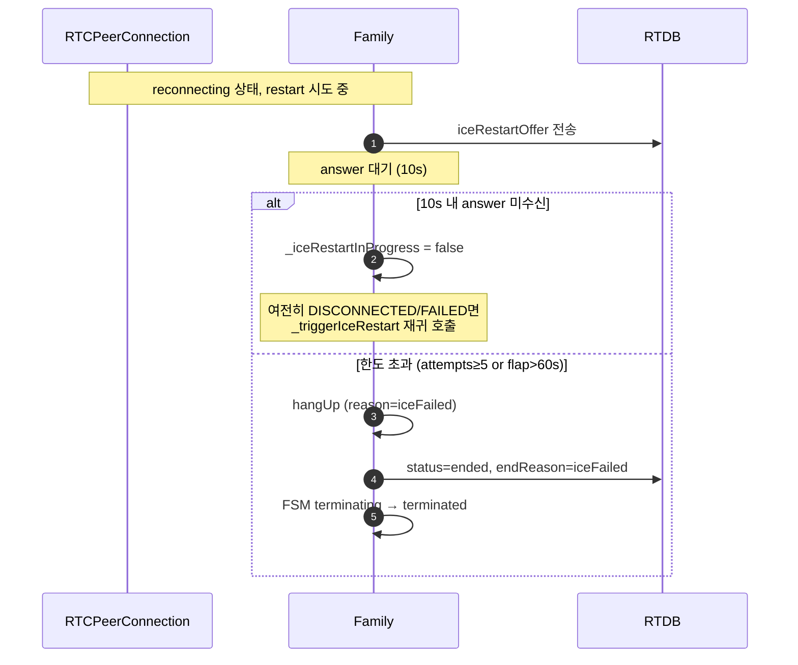

구현: [webrtc_service.dart:448-513](../lib/services/call/webrtc_service.dart#L448-L513)

---

## 8. 비정상 종료 — 앱 크래시 / 네트워크 끊김

Firebase onDisconnect 핸들러가 서버 측에서 자동 cleanup.

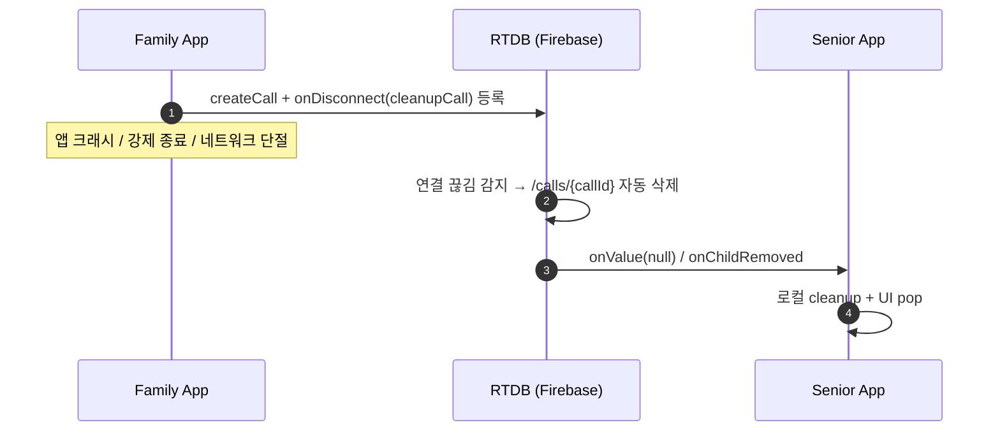

---

## 9. 비정상 종료 — Senior 측 종료 감지

Family가 Senior의 종료 이벤트를 감지하고 적절한 이유로 매핑.

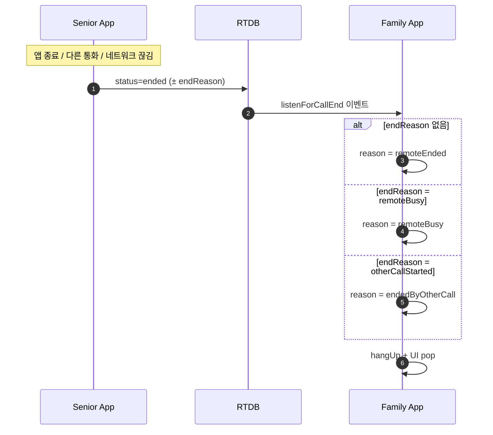

---

## 10. 종료 사유(endReason) 매트릭스

| endReason | 트리거 | FSM 경유 | UI 메시지 |
| --------- | ------ | -------- | --------- |
| `normal` | 사용자 hangUp | terminating | 통화 종료 |
| `unreachable` | Phase 1 timeout (5s) | connecting→terminating | 응답 없음 |
| `noAcceptance` | Phase 2 timeout (20s) | connected→terminating | 수신자가 받지 않음 |
| `iceFailed` | flap>60s or attempts≥5 | reconnecting→terminating | 연결 실패 |
| `remoteEnded` | 원격 status=ended | connected→terminating | 상대방이 종료 |
| `remoteBusy` | Senior 다른 통화 중 | connecting→terminating | 통화 중 |
| `capacityExceeded` | Senior MAX_PEERS 초과 | connecting→terminating | 모니터링 한도 초과 |
| `otherCallStarted` | 모니터링 중 Senior가 call 수락 → displace | connected→terminating | 모니터링이 종료되었습니다 |

### 10-1. `otherCallStarted` 상세 (1:N displace 절차)

**발생 조건**: Family B 가 영상통화 발신 → Senior 수락 (`setSeniorAccepted=true`) → `MonitoringSession.handleUpgradeRequest()` 끝에서 `displaceOtherMonitors()` 호출.

**Senior 동작** (`MonitoringSession.kt:820-840`): 모든 `callType=="monitor"` peer 에 대해

1. `SignalingClient.rejectCall(cid, EndReason.OTHER_CALL_STARTED)` → RTDB `/calls/{cidX}/{status="ended", endReason="otherCallStarted"}` write
2. `stopPeer(cid, skipSignalingHangup=true, skipCallStatusUpdate=true)` → 로컬 peer cleanup

**Family 동작** (displace 당한 monitor 측):

1. `listenForCallEnd` → `_mapEndReason("otherCallStarted")` → `TerminateReason.endedByOtherCall`
2. FSM: `connected/reconnecting → terminating (hangup:endedByOtherCall) → terminated (cleanup_done)`
3. `MonitoringScreen._getDialogTexts(endedByOtherCall)` ([monitoring_screen.dart:395-399](../lib/screens/monitoring_screen.dart#L395-L399)) →
   - 제목: "모니터링이 종료되었습니다"
   - 본문: "가족이 영상통화를 시작하여 모니터링이 종료되었습니다."
   - 재시도 버튼 없음 → 확인 시 pop

**displace 직전** (Family B call 아직 `type='call'` 로 RTDB 쓰기 반영되는 짧은 순간): Family A 의 `_callStatusSub` 가 `callStatus.type=='call' && active` 감지 → `_callActiveByOther=true` → [monitoring_screen.dart:706](../lib/screens/monitoring_screen.dart#L706) "통화 전환" 버튼 숨김. 뒤이어 endReason 수신 → 다이얼로그.

상세 시퀀스는 [§13 1:N × 1:1 정책 흐름](#13-1n--11-정책-흐름) 참조.

### 10-2. `remoteBusy` 상세 (call 배타 정책)

**발생 조건**: Senior 가 이미 `callType="call"` 로 통화 중 → 다른 Family 가 call 발신.

**Senior 동작**: 새 call offer 도달 시 기존 call 존재 감지 → `rejectCall(..., REMOTE_BUSY)` → RTDB `endReason="remoteBusy"` write. 기존 call peer 는 영향 없음.

**Family 동작** (새 call 발신자): `_mapEndReason("remoteBusy") → TerminateReason.remoteBusy` → 다이얼로그 "{Senior 이름}이(가) 통화 중입니다 / 다른 가족이 통화 중입니다. 잠시 후 다시 시도해주세요." → pop.

### 10-3. `capacityExceeded` 상세 (MAX_PEERS=3)

**발생 조건**: Senior 가 이미 monitor peer 3개 운영 중 → 4번째 Family 가 monitor 발신.

**Senior 동작**: peers 카운터 3 초과 감지 → `rejectCall(..., CAPACITY_EXCEEDED)` → RTDB `endReason="capacityExceeded"` write.

**Family 동작**: `_mapEndReason("capacityExceeded") → TerminateReason.capacityExceeded` → 다이얼로그 "모니터링 한도 초과" → pop.

---

## 11. RTDB `/calls/{callId}/` 필드 요약

```text
/calls/{callId}/
├── offer                   SDP offer (Family 작성)
├── answer                  SDP answer (Senior 작성)
├── status                  ringing | connected | ended
├── callType                call | monitor
├── endReason               위 매트릭스 참조
├── targetDeviceId          Senior 기기 ANDROID_ID
├── targetFamilyId          가족 그룹 ID
├── callerUid               Family 사용자 UID
├── callerName              표시 이름
├── createdAt               ServerValue.timestamp
├── seniorAccepted          Phase 2 수락 플래그 (call only)
├── upgradeRequest          call (monitor→call 전환)
├── renegotiateOffer        SDP (upgrade)
├── renegotiateAnswer       SDP (upgrade 응답)
├── iceRestartOffer         SDP (ICE restart)
├── iceRestartAnswer        SDP (ICE restart 응답)
├── callerCandidates/{push} candidate, sdpMid, sdpMLineIndex
└── calleeCandidates/{push} candidate, sdpMid, sdpMLineIndex
```

종료 정리: `status=ended` 기록 후 10초 지연 → 노드 delete.

---

## 12. 타임아웃 상수

| 상수 | 값 | 위치 |
| ---- | -- | ---- |
| Phase 1 (answer 대기) | 5s | `startCall` / `startMonitoring` |
| Phase 2 (seniorAccepted 대기) | 20s | `_listenForSeniorAccepted` |
| DISCONNECTED grace | 4s | `_startDisconnectedGrace` |
| ICE restart answer 대기 | 10s | `_iceRestartAnswerTimeoutMs` |
| ICE restart 한도 | 5회 / 60s window | `_maxIceRestartAttempts` / `_maxFlapWindowMs` |
| 종료 후 노드 정리 | 10s | `hangUp` (fire-and-forget) |
| RTDB write timeout | 3s | `writeOrTimeout` (NetworkGuard) |
| Senior monitor peer 상한 | 3 (`MAX_PEERS`) | Senior `MonitoringSession` |
| Senior STOP_DELAY (RESTARTING 중) | 15s | Senior `MonitoringPeer` |

---

## 13. 1:N × 1:1 정책 흐름

**정책 요약**:

- Senior 1대에 여러 Family 가 **monitor 동시 가능** (최대 `MAX_PEERS=3`)
- **Call 은 배타적** (1개만 허용). call 시작 시 기존 monitor 들은 `endReason="otherCallStarted"` 로 **자동 displace**
- Call 중 다른 Family 의 call 시도 → `endReason="remoteBusy"` 로 거절
- 4번째 Family 의 monitor 시도 → `endReason="capacityExceeded"` 로 거절

### 13-1. displace 시퀀스 (Family A monitor 중 → Family B call)

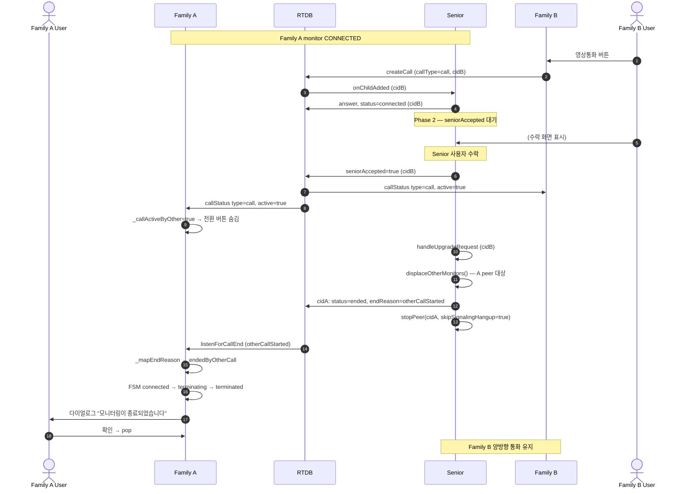

### 13-2. remoteBusy 시퀀스 (Family A call 중 → Family B call 시도)

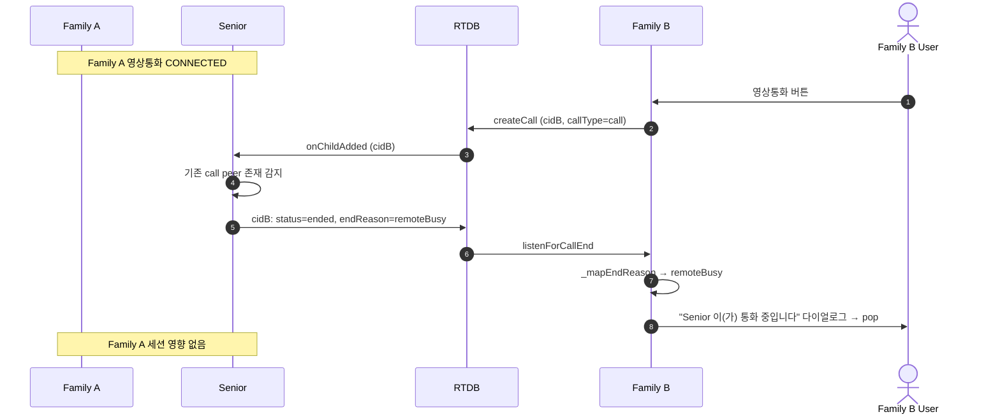

### 13-3. capacityExceeded 시퀀스 (4번째 monitor 시도)

```text
Senior peers 현재 상태: A(monitor) + B(monitor) + C(monitor) = 3
   ↓
Family D (4번째) 가 monitor 발신
   ↓
Senior: peers 카운터 3 ≥ MAX_PEERS → rejectCall(CAPACITY_EXCEEDED)
   ↓
Family D: endReason="capacityExceeded" 수신 → "모니터링 한도 초과" 다이얼로그 → pop
```

### 13-4. Family 측 UX 참조

| 상황 | Family UX | 코드 경로 |
|---|---|---|
| Monitor 중 다른 Family call 시작 감지 | "통화 전환" 버튼 숨김 | [monitoring_screen.dart:156-170, 706](../lib/screens/monitoring_screen.dart#L156-L170) `_callActiveByOther` |
| Monitor displace 당함 | 다이얼로그 + pop | [monitoring_screen.dart:395-399](../lib/screens/monitoring_screen.dart#L395-L399) `endedByOtherCall` |
| Call 버튼 활성화 제어 | Senior call 중이면 비활성 | [family_detail_screen.dart:148-149, 744](../lib/screens/family_detail_screen.dart#L148-L149) `_isInCall = active && type=='call'` |
| Monitor 버튼 활성화 | 언제나 (1:N) | [family_detail_screen.dart:745](../lib/screens/family_detail_screen.dart#L745) `canMonitor = _isOnline` |

### 13-5. 관련 회귀 테스트

실기기 실측 시나리오는 [ICE_restart_test.md §5 "1:N 환경 회귀 테스트" (R5~R8)](ICE_restart_test.md) 참조.
