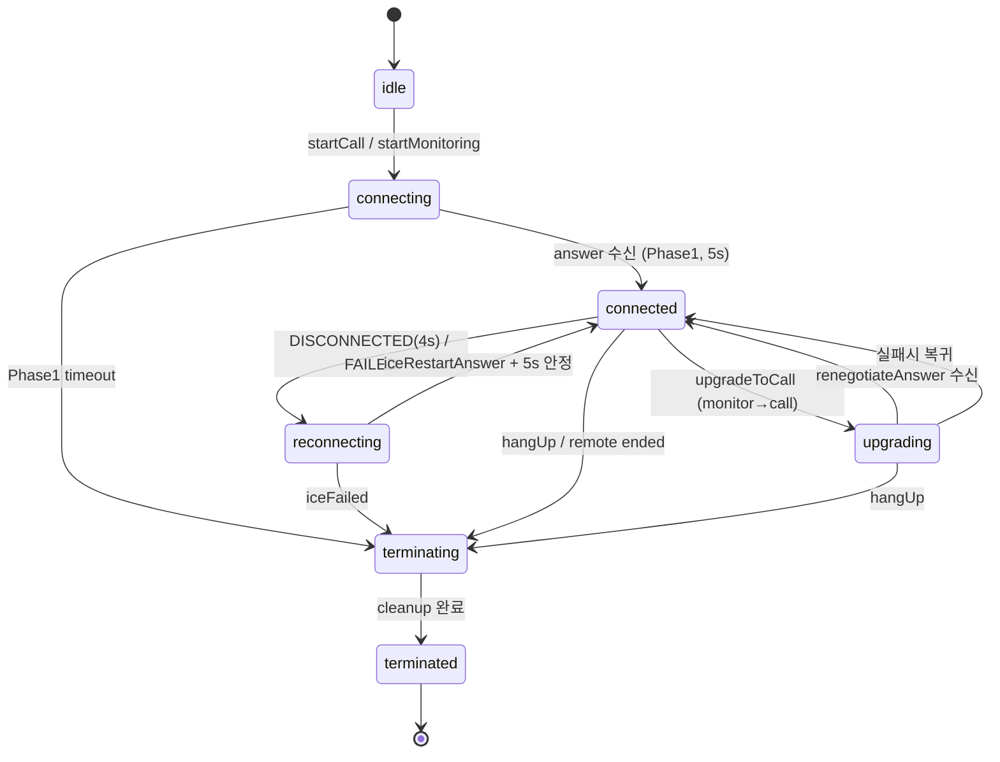
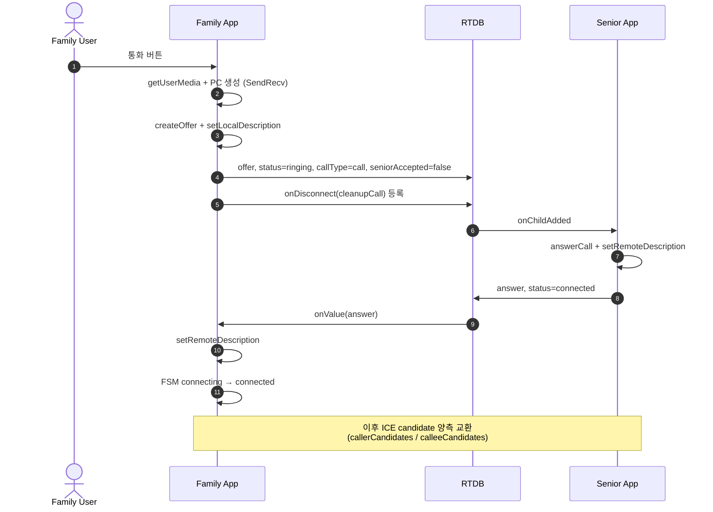
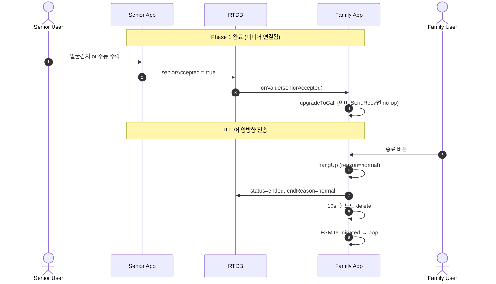
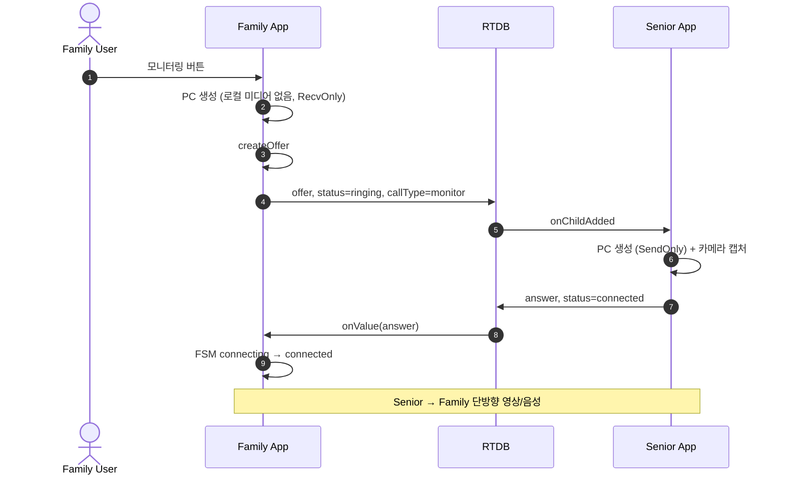
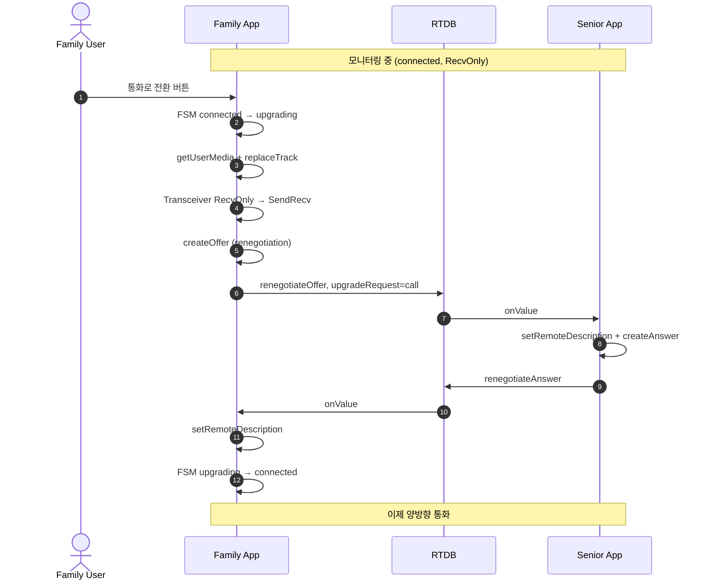
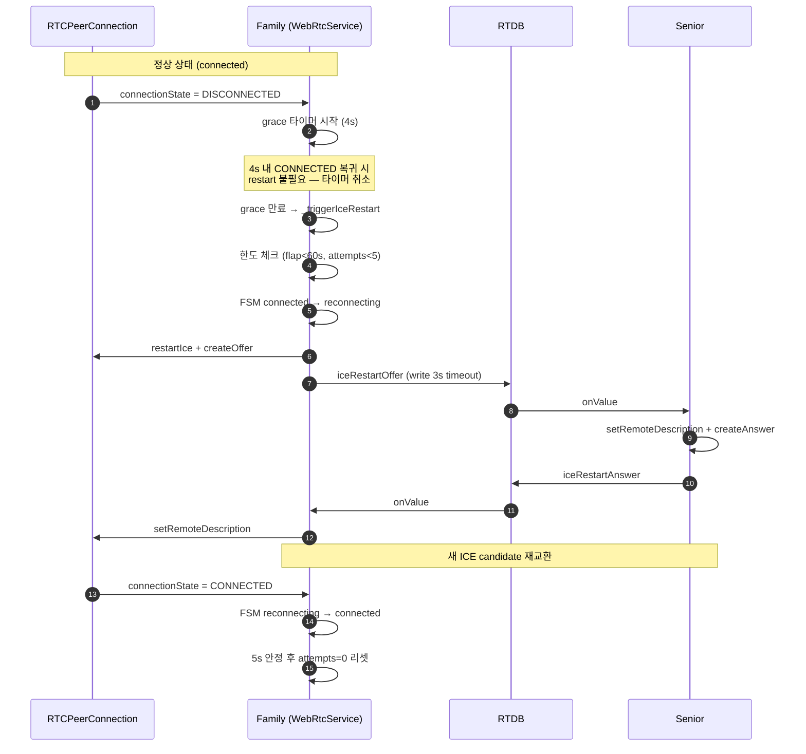
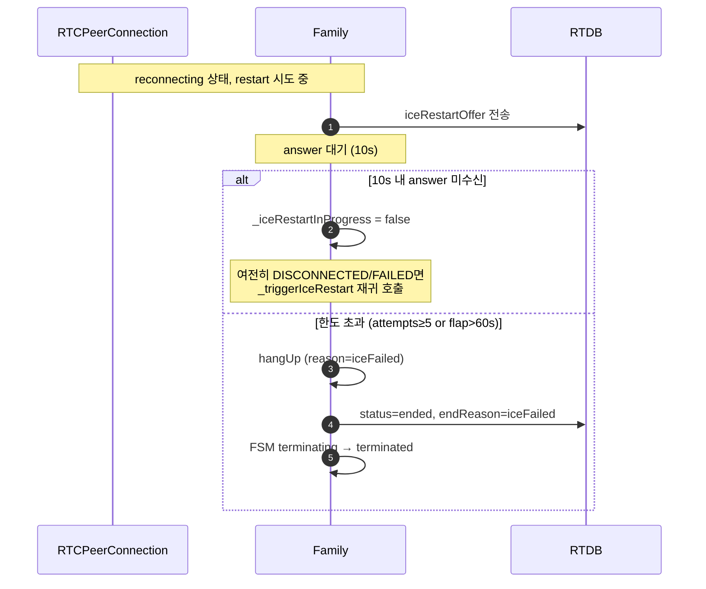
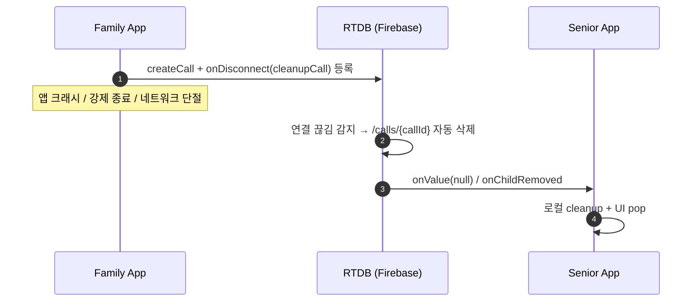
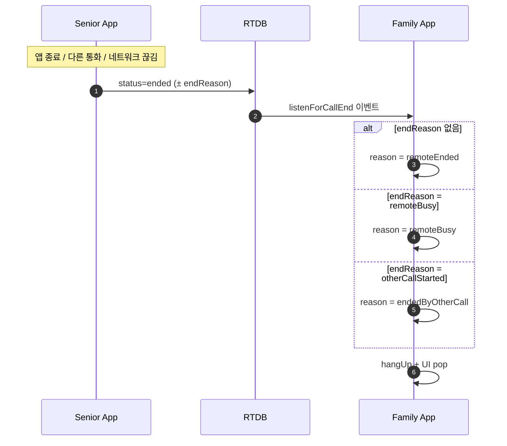

# 영상통화 / 모니터링 시나리오 다이어그램

Family ↔ Senior WebRTC 통화 · 모니터링 · ICE restart 전 시나리오.

> 시그널링 채널: Firebase RTDB `/calls/{callId}/`
> 구현 경로: [webrtc_service.dart](../lib/services/call/webrtc_service.dart), [signaling_service.dart](../lib/services/call/signaling_service.dart)

---

## 1. FSM 전체 상태 다이어그램



---

## 2. 양방향 통화 발신 — Phase 1 (벨 울림)

Senior 앱이 offer를 받고 answer를 돌려주는 단계. 5초 타임아웃.



Phase 1 timeout → `unreachable` (Senior 미실행/오프라인).

---

## 3. 양방향 통화 발신 — Phase 2 (실제 수락)

Senior 사용자의 얼굴감지 또는 수동 수락. 20초 타임아웃.



Phase 2 timeout → `noAcceptance` (벨은 울렸으나 응답 없음).

---

## 4. CCTV 모니터링 (callType=monitor)

Family는 로컬 미디어 없이 Senior 영상만 수신 (RecvOnly).



---

## 5. 모니터링 → 통화 전환 (upgradeToCall)

RecvOnly 상태에서 사용자가 "통화 전환" 버튼 누르면 renegotiation 수행.



실패 시 monitor 상태로 복귀.

---

## 6. ICE Restart — 정상 복구

네트워크 전환(Wi-Fi↔LTE), NAT rebinding, 일시 단절 시 자동 복구.



**FAILED 상태는 grace 없이 즉시 restart 트리거**.

---

## 7. ICE Restart — 한도 초과 / 실패

answer 미수신 자동 재시도, 최종 실패 시 iceFailed 종료.



구현: [webrtc_service.dart:448-513](../lib/services/call/webrtc_service.dart#L448-L513)

---

## 8. 비정상 종료 — 앱 크래시 / 네트워크 끊김

Firebase onDisconnect 핸들러가 서버 측에서 자동 cleanup.



---

## 9. 비정상 종료 — Senior 측 종료 감지

Family가 Senior의 종료 이벤트를 감지하고 적절한 이유로 매핑.



---

## 10. 종료 사유(endReason) 매트릭스

| endReason | 트리거 | FSM 경유 | UI 메시지 |
| --------- | ------ | -------- | --------- |
| `normal` | 사용자 hangUp | terminating | 통화 종료 |
| `unreachable` | Phase 1 timeout (5s) | connecting→terminating | 응답 없음 |
| `noAcceptance` | Phase 2 timeout (20s) | connected→terminating | 수신자가 받지 않음 |
| `iceFailed` | flap>60s or attempts≥5 | reconnecting→terminating | 연결 실패 |
| `remoteEnded` | 원격 status=ended | connected→terminating | 상대방이 종료 |
| `remoteBusy` | Senior 다른 통화 중 | connecting→terminating | 통화 중 |
| `capacityExceeded` | Senior MAX_PEERS 초과 | connecting→terminating | 모니터링 한도 초과 |
| `otherCallStarted` | 모니터링 중 Senior가 call 시작 | connected→terminating | 다른 통화로 전환됨 |

---

## 11. RTDB `/calls/{callId}/` 필드 요약

```text
/calls/{callId}/
├── offer                   SDP offer (Family 작성)
├── answer                  SDP answer (Senior 작성)
├── status                  ringing | connected | ended
├── callType                call | monitor
├── endReason               위 매트릭스 참조
├── targetDeviceId          Senior 기기 ANDROID_ID
├── targetFamilyId          가족 그룹 ID
├── callerUid               Family 사용자 UID
├── callerName              표시 이름
├── createdAt               ServerValue.timestamp
├── seniorAccepted          Phase 2 수락 플래그 (call only)
├── upgradeRequest          call (monitor→call 전환)
├── renegotiateOffer        SDP (upgrade)
├── renegotiateAnswer       SDP (upgrade 응답)
├── iceRestartOffer         SDP (ICE restart)
├── iceRestartAnswer        SDP (ICE restart 응답)
├── callerCandidates/{push} candidate, sdpMid, sdpMLineIndex
└── calleeCandidates/{push} candidate, sdpMid, sdpMLineIndex
```

종료 정리: `status=ended` 기록 후 10초 지연 → 노드 delete.

---

## 12. 타임아웃 상수

| 상수 | 값 | 위치 |
| ---- | -- | ---- |
| Phase 1 (answer 대기) | 5s | `startCall` / `startMonitoring` |
| Phase 2 (seniorAccepted 대기) | 20s | `_listenForSeniorAccepted` |
| DISCONNECTED grace | 4s | `_startDisconnectedGrace` |
| ICE restart answer 대기 | 10s | `_iceRestartAnswerTimeoutMs` |
| ICE restart 한도 | 5회 / 60s window | `_maxIceRestartAttempts` / `_maxFlapWindowMs` |
| 종료 후 노드 정리 | 10s | `hangUp` (fire-and-forget) |
| RTDB write timeout | 3s | `writeOrTimeout` (NetworkGuard) |
