# 영상통화 / 모니터링 시나리오 다이어그램

Family ↔ Senior WebRTC 통화 · 모니터링 · ICE restart 전 시나리오. **Plan B (필드 분리 hasFlapMarker) + ICE restart 1회 시도 + Family UX 단순화** 정착 후 기준.

> 시그널링 채널: Firebase RTDB `/calls/{callId}/`
> 구현 경로: [webrtc_service.dart](../lib/services/call/webrtc_service.dart), [signaling_service.dart](../lib/services/call/signaling_service.dart)

---

## 1. FSM 전체 상태 다이어그램

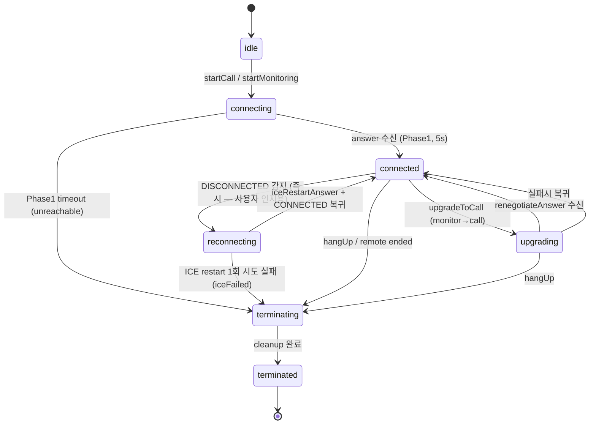

FSM 핵심:

- `connected → reconnecting`: DISCONNECTED 감지 즉시 (사용자 즉시 인지용 오버레이)
- `reconnecting → connected`: ICE restart answer 수신 또는 PC 자체 reconnect (5s 안정 대기 없음)
- `reconnecting → terminating (iceFailed)`: ICE restart 1회 시도 실패 시 (재시도 없음)

---

## 2. 양방향 통화 발신 — Phase 1 (벨 울림)

Senior 앱이 offer를 받고 answer를 돌려주는 단계. 5초 타임아웃.


Phase 1 timeout → `unreachable` (Senior 미실행/오프라인).

---

## 3. 양방향 통화 발신 — Phase 2 (실제 수락)

Senior 사용자의 얼굴감지 또는 수동 수락. 20초 타임아웃.

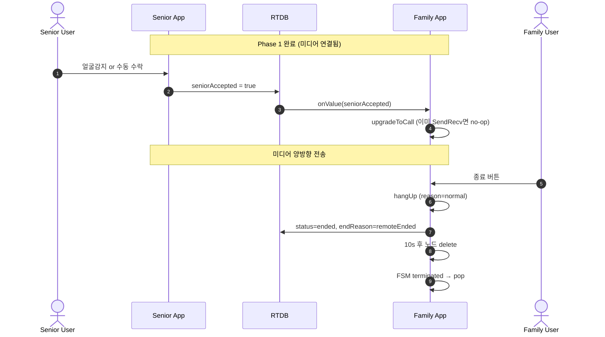

Phase 2 timeout → `noAcceptance` (벨은 울렸으나 응답 없음).

---

## 4. CCTV 모니터링 (callType=monitor)

Family는 로컬 미디어 없이 Senior 영상만 수신 (RecvOnly).

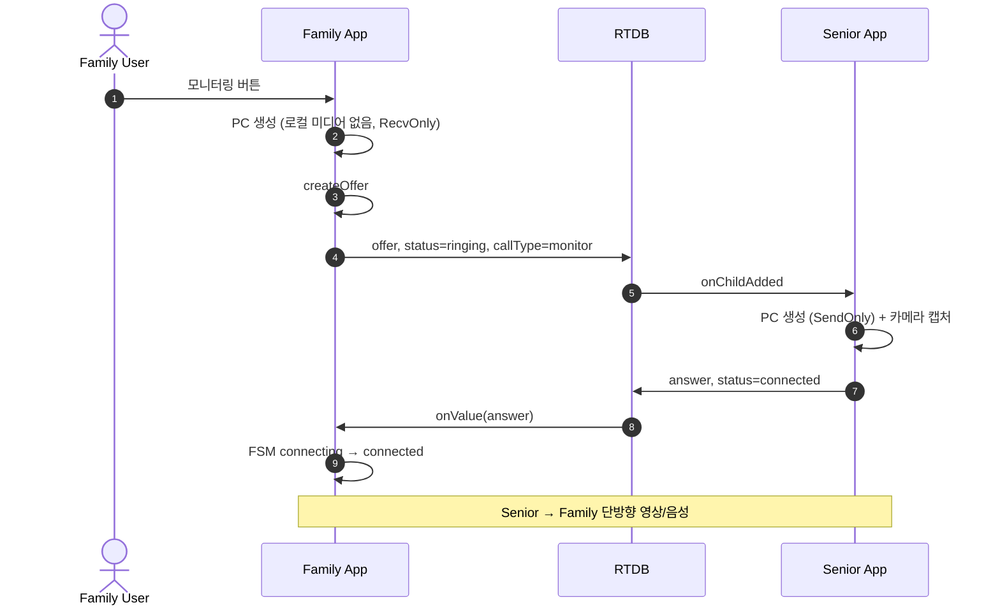

---

## 5. 모니터링 → 통화 전환 (upgradeToCall)

RecvOnly 상태에서 사용자가 "통화 전환" 버튼 누르면 renegotiation 수행.

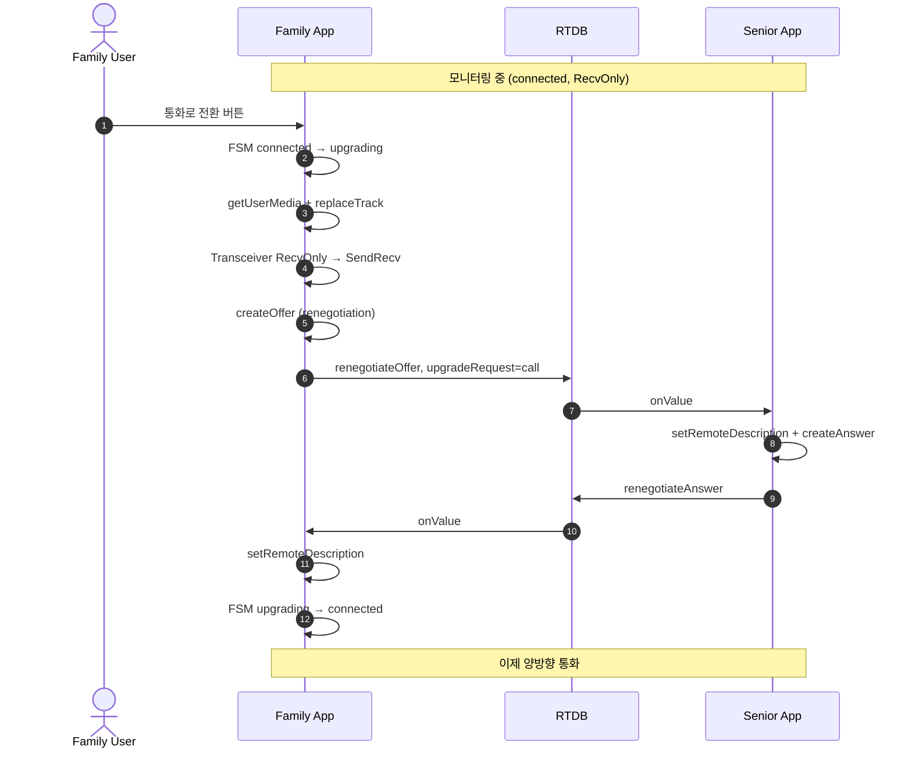

실패 시 monitor 상태로 복귀.

---

## 6. ICE Restart — 정상 복구

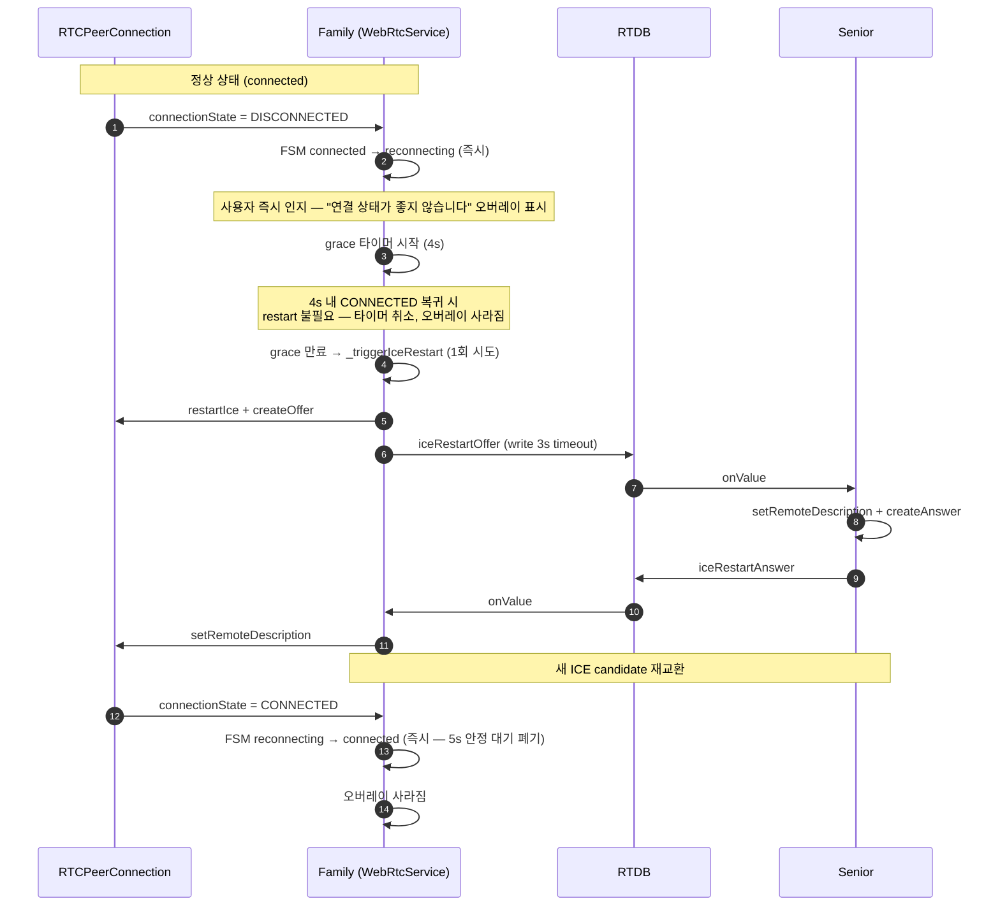

- `_iceRestartAttempts`, `_flapWindowStart`, `_stableTimer` 모두 폐기 (1회 시도 정책)
- FSM `connected → reconnecting` 즉시 전이 → 사용자 즉시 인지

**FAILED 상태**: grace 없이 즉시 1회 ICE restart 트리거.

**PC keepalive race fix**: ICE restart offer/answer NetworkException 또는 10s timeout 시 PC=CONNECTED 면 networkLost skip — PC 자체 reconnect 가 ICE restart 보다 빠른 케이스에서 통화 유지 ([webrtc_service.dart `_triggerIceRestart`](../lib/services/call/webrtc_service.dart)).

---

## 7. ICE Restart — 1회 시도 실패

answer 미수신 또는 createOffer/RTDB write 실패 시 즉시 종결. **재시도 없음**.

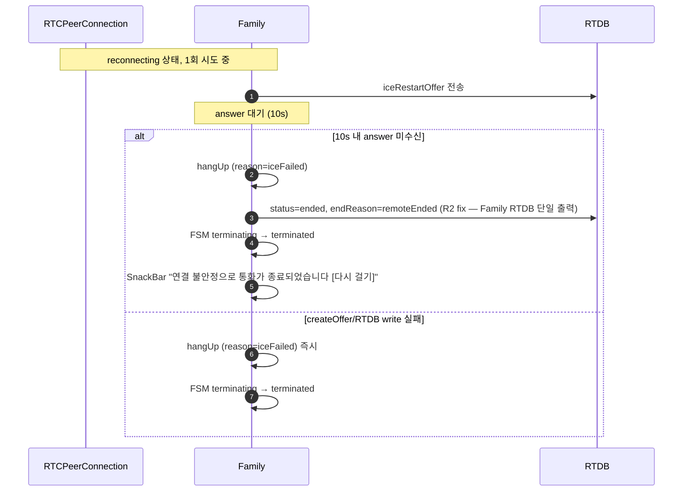

- `_iceRestartInProgress` 가드만 남기고 재시도 / 한도 / flap window 모두 폐기
- 종결 시 SnackBar 2s + 즉시 pop (§14 참조)

구현: [webrtc_service.dart `_triggerIceRestart`](../lib/services/call/webrtc_service.dart)

---

## 8. 비정상 종료 — 앱 크래시 / 네트워크 끊김

Plan B: Firebase server-side onDisconnect 가 `hasFlapMarker=true` 자동 set (status 안 건드림). 상세 §10-4.

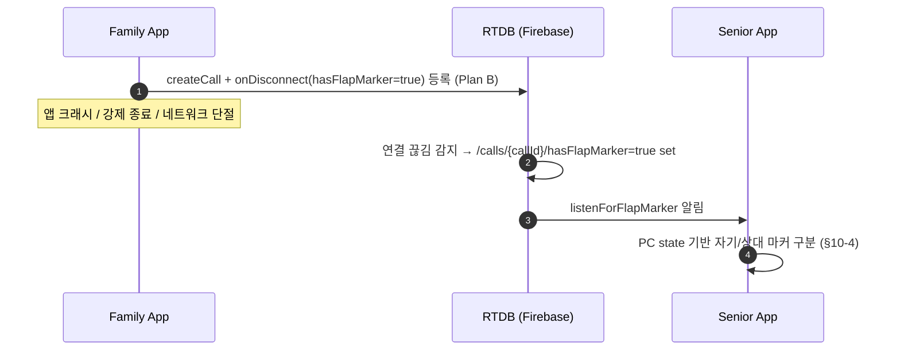

---

## 9. 비정상 종료 — Senior 측 종료 감지

Family가 Senior의 종료 이벤트를 감지하고 적절한 이유로 매핑.

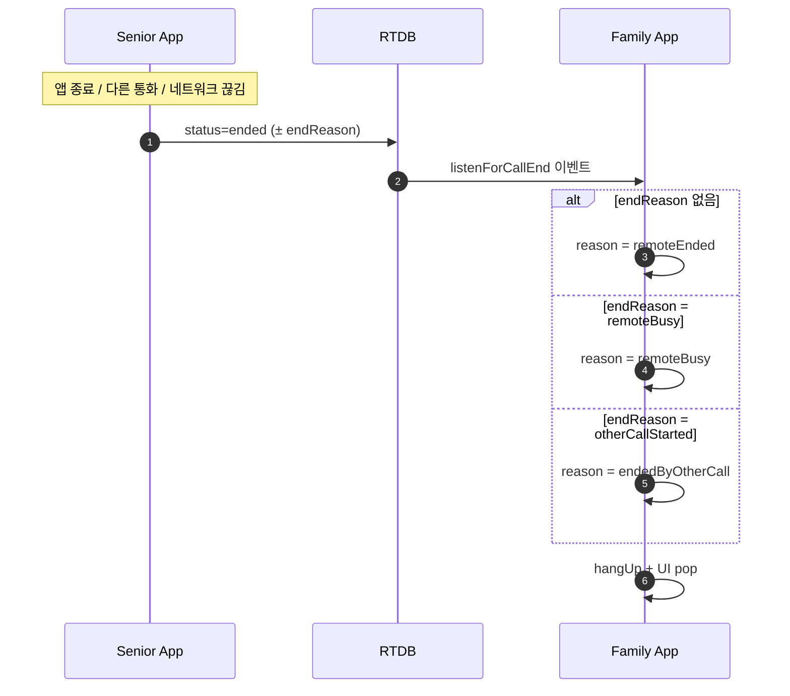

---

## 10. 종료 사유(endReason) 매트릭스

> ⚠️ **TerminateReason ≠ RTDB endReason**: 본 표의 행 중 일부는 Family `TerminateReason` (Dart enum, 메모리 안에서만) 이고, 일부는 RTDB `/calls/{cid}/endReason` string 값. "RTDB 도달" 컬럼으로 구분. Family 가 RTDB 에 실제로 쓰는 endReason 은 **`"remoteEnded"` 한 가지만** (R2 fix 이후).

| endReason | RTDB 도달 | RTDB Writer | 트리거 | FSM 경유 | UI 메시지 |
| --------- | :---: | --- | ------ | -------- | --------- |
| `normal` | ✅ | Senior `markEnded`/`hangUp` | Senior 사용자 명시적 hangUp | terminating | 통화 종료 |
| `unreachable` | ❌ | (Family 내부 enum 만) | Phase 1 timeout (5s) | connecting→terminating | 응답 없음 |
| `noAcceptance` | ❌ | (Family 내부 enum 만) | Phase 2 timeout (20s) | connected→terminating | 수신자가 받지 않음 |
| **`iceFailed`** | ❌ | (Family 내부 enum 만) | **ICE restart 1회 시도 실패** (answer 10s 미수신 또는 createOffer/RTDB write 실패) | reconnecting→terminating | **"연결 불안정으로 통화가 종료되었습니다" SnackBar + "다시 걸기"** |
| `remoteEnded` | ✅ | Family `endCall` (R2 fix) — 모든 Family 측 종결의 단일 RTDB 값 | Family 측이 종결 (사용자 hangUp / iceFailed / 등 어떤 내부 사유든) | connected→terminating | 상대방이 종료 |
| `remoteBusy` | ✅ | Senior `rejectCall` | Senior 다른 통화 중 | connecting→terminating | 통화 중 |
| `capacityExceeded` | ✅ | Senior `rejectCall` | Senior MAX_PEERS(3) 초과 | connecting→terminating | 모니터링 한도 초과 |
| `otherCallStarted` | ✅ | Senior `rejectCall` | 모니터링 중 Senior 가 call 수락 → displace | connected→terminating | 모니터링이 종료되었습니다 |
| ~~`seniorDisconnect`~~ | ❌ (Plan B 폐기) | Server-side onDisconnect (S16 fix, Plan A 까지) | Plan B 에서 `hasFlapMarker` 별도 필드로 대체. status 안 건드림. | — | — |
| `hasFlapMarker` (필드, Plan B) | ✅ | Server-side onDisconnect (양측) | Family/Senior wifi 끊김 시 자동 set. status 무관. | 별도 listener 가 grace 분기 — PC=CONNECTED 면 자기 마커 clear, ≠CONNECTED 면 상대 wifi flap → grace 진입 | (UI 변경 없음) |
| `userHangup`, `networkOffline`, `upgradeFailed`, `endedByOtherCall` | ❌ | (Family 내부 enum 만) | 다양 — Family `_mapEndReason` 또는 자체 hangUp reason | 다양 | 다양 |

### 왜 Family RTDB 는 "remoteEnded" 한 가지 — TerminateReason vs RTDB endReason

Family `TerminateReason` enum 10종은 Family UI/로깅 분기용 (메모리 안에서만 살음). RTDB 통신용 endReason 은 Family↔Senior 단일 통신 채널 — Senior 입장에선 Family 가 어떤 이유로 끝났든 후속 동작 동일 (`stopPeer` + 정리). 따라서 Family `endCall` 은 호출자의 `TerminateReason` 과 무관하게 **항상 `endReason="remoteEnded"`** 한 값만 RTDB 에 씀. 자세한 layer 분리는 [RTDB_schema.md /calls Writer 매트릭스](RTDB_schema.md) 참조.

### 10-1. `otherCallStarted` 상세 (1:N displace 절차)

**발생 조건**: Family B 가 영상통화 발신 → Senior 수락 (`setSeniorAccepted=true`) → `MonitoringSession.handleUpgradeRequest()` 끝에서 `displaceOtherMonitors()` 호출.

**Senior 동작** (`MonitoringSession.kt:820-840`): 모든 `callType=="monitor"` peer 에 대해

1. `SignalingClient.rejectCall(cid, EndReason.OTHER_CALL_STARTED)` → RTDB `/calls/{cidX}/{status="ended", endReason="otherCallStarted"}` write
2. `stopPeer(cid, skipSignalingHangup=true, skipCallStatusUpdate=true)` → 로컬 peer cleanup

**Family 동작** (displace 당한 monitor 측):

1. `listenForCallEnd` → `_mapEndReason("otherCallStarted")` → `TerminateReason.endedByOtherCall`
2. FSM: `connected/reconnecting → terminating (hangup:endedByOtherCall) → terminated (cleanup_done)`
3. `MonitoringScreen._getDialogTexts(endedByOtherCall)` ([monitoring_screen.dart:395-399](../lib/screens/monitoring_screen.dart#L395-L399)) →
   - 제목: "모니터링이 종료되었습니다"
   - 본문: "가족이 영상통화를 시작하여 모니터링이 종료되었습니다."
   - 재시도 버튼 없음 → 확인 시 pop

**displace 직전** (Family B call 아직 `type='call'` 로 RTDB 쓰기 반영되는 짧은 순간): Family A 의 `_callStatusSub` 가 `callStatus.type=='call' && active` 감지 → `_callActiveByOther=true` → [monitoring_screen.dart:706](../lib/screens/monitoring_screen.dart#L706) "통화 전환" 버튼 숨김. 뒤이어 endReason 수신 → 다이얼로그.

상세 시퀀스는 [§13 1:N × 1:1 정책 흐름](#13-1n--11-정책-흐름) 참조.

### 10-2. `remoteBusy` 상세 (call 진행 중 신규 peer 전체 차단 정책)

**발생 조건**: Senior 가 이미 `callType="call"` 로 통화 중 (INCOMING/IN_CALL) → 다른 Family 가 **call 또는 monitor 발신**.

**정책**: 영상통화 (call) 진행 중에는 **신규 call 뿐 아니라 신규 monitor 도 모두 거절** ([MonitoringSession.kt:436-448](../../Senior/app/src/main/java/com/seniorcare/senior/call/MonitoringSession.kt#L436-L448)).

- 이유: call 의 양방향 audio/video 라우팅과 새 monitor peer 의 broadcast fan-out 충돌. 깔끔한 격리 위해 call 동안 모든 신규 peer 차단.
- 호환: 영상통화 종료 후 자동으로 신규 monitor/call 다시 받음.

**Senior 동작**: 새 call/monitor offer 도달 시 기존 call 존재 감지 → `rejectCall(..., REMOTE_BUSY)` → RTDB `endReason="remoteBusy"` write. 기존 call peer 는 영향 없음.

**Family 동작** (새 발신자): `_mapEndReason("remoteBusy") → TerminateReason.remoteBusy` → 다이얼로그 "{Senior 이름}이(가) 통화 중입니다" → pop.

**핵심**: 차단 시점은 **INCOMING 단계부터** (수락 전부터). 첫 번째 call 발신자가 INCOMING 표시되는 순간부터 모든 신규 요청 거절. 결과적으로 **call peer 는 동시에 최대 1개**.

### 10-3. `capacityExceeded` 상세 (MAX_PEERS=3, monitor 한정)

**발생 조건**: Senior 가 이미 **monitor peer** 3개 운영 중 → 4번째 Family 가 monitor 발신.

**Senior 동작**: peers 카운터 3 초과 감지 → `rejectCall(..., CAPACITY_EXCEEDED)` → RTDB `endReason="capacityExceeded"` write.

**Family 동작**: `_mapEndReason("capacityExceeded") → TerminateReason.capacityExceeded` → 다이얼로그 "모니터링 한도 초과" → pop.

**주의**: MAX_PEERS=3 은 **monitor 에만 적용**. call 은 별개 제약 ([MonitoringSession.kt:452-457](../../Senior/app/src/main/java/com/seniorcare/senior/call/MonitoringSession.kt#L452-L457)).

- monitor 3개 active 상태에서 call 1개 발신 → 허용 → **일시 peer=4** (INCOMING 단계, 최대 30s)
- INCOMING 도중 다른 신규 요청 (5번째) → §10-2 remoteBusy 거절
- 수락 시 `displaceOtherMonitors()` → monitor 3개 모두 `otherCallStarted` 거절 → peer=1 (call only)
- 수락 안 됨 (30s 타임아웃) → status="ended" → peer=3 (monitor 그대로)

### 10-3-1. Capacity 정책 종합 매트릭스

| 현재 상태 | new monitor 요청 | new call 요청 |
| --- | --- | --- |
| 진행 중 call (INCOMING/IN_CALL) | ❌ remoteBusy | ❌ remoteBusy |
| monitor peers ≥ 3 (call 없음) | ❌ capacityExceeded | ✅ 허용 (일시 peer=4) |
| monitor peers < 3, call 없음 | ✅ 허용 | ✅ 허용 |

**불변량**: `call peer ≤ 1` (항상). `monitor peer ≤ 3` (항상). 동시 최대 peer = 4 (3 monitor + 1 call INCOMING, max 30s).

### 10-4. `hasFlapMarker` 상세 (Plan B — wifi flap 신호 별도 필드)

**Plan B 핵심 변경**: Plan A 의 `endReason="familyDisconnect"`/`"seniorDisconnect"` 마커 폐기 →
`hasFlapMarker=true` 별도 필드 도입. `status` 는 정상 종결만 변경 → 모든 listener 가
endReason 분기 없이 처리 가능 (race 폭발 해결).

**발생 조건**:
- Family 또는 Senior wifi 끊김 → Firebase server-side onDisconnect 가 `hasFlapMarker=true` 자동 set.

**Family 동작** ([webrtc_service.dart](../lib/services/call/webrtc_service.dart)):

신규 `_flapMarkerSub` 리스너가 hasFlapMarker 변경 감지 → PC connectionState 기반 자기/상대 마커 구분.

- **PC=CONNECTED**: 자기 마커 추정 (wifi 복귀 후 자기가 set 한 마커가 RTDB 에서 도달).
  → `clearFlapMarker(callId)` + `setCallCleanupOnDisconnect(callId)` (재등록).
- **PC≠CONNECTED**: 상대 (Senior) wifi flap 추정.
  → 별도 timer 안 둠 — PC keepalive 가 곧 끊김 인지 → `_onPeerConnectionStateChanged` →
    grace 4s + ICE restart 1회 시도 자체 흐름 위임.

**Senior 동작** ([MonitoringSession.kt](../../Senior/app/src/main/java/com/seniorcare/senior/call/MonitoringSession.kt)):

신규 `listenForFlapMarker` 리스너가 hasFlapMarker 변경 감지 → 동일 PC state 분기.

- **PC=CONNECTED**: 자기 마커 → clear + onDisconnect 재등록 (`registerDisconnectCleanup` 재호출).
- **PC≠CONNECTED**: 상대 (Family) wifi flap → `scheduleStopPeer(callId, STOP_DELAY_MS=7s)`. ICE restart offer 도착 시 cancel.

**복구 가능 한계**:
- Family wifi off **1~6초** [모니터링/영상통화]: ICE restart 1회 시도로 복구 (떠받침)
- Family wifi off **15초+**: Family ICE restart 시점 wifi 아직 off → networkLost 정상 종결
- Senior wifi off **1~4초**: ICE restart 1회 시도로 복구 (떠받침)
- Senior wifi off **5초+**: Senior PC keepalive timeout + STOP_DELAY 7s 만료 → networkLost 정상 종결

**Plan A 대비 race 해결**:
- 영상통화 1→2 전이 시 race (S13) — Plan A 에서는 status="ended" + endReason="familyDisconnect" 마커가
  upgradeToCall 의 RTDB write 를 막아서 noAcceptance 종결 발생. Plan B 는 status="active" 그대로 유지 →
  upgrade 정상 진행 → race 사라짐.
- 사용자 hangup 시 Senior 가 늦게 종결되던 race — Plan A 에서는 active 복원 비동기 vs hangup 동시 race.
  Plan B 는 status 자체 안 건드리니 복원 불필요 → race 사라짐.

검증 결과는 [webrtc_integration_test_result.md](./webrtc_integration_test_result.md) 참조.

---

## 11. RTDB `/calls/{callId}/` 필드 요약

```text
/calls/{callId}/
├── offer                   SDP offer (Family 작성)
├── answer                  SDP answer (Senior 작성)
├── status                  ringing | connected | ended
├── callType                call | monitor
├── endReason               위 매트릭스 참조
├── targetDeviceId          Senior 기기 ANDROID_ID
├── targetFamilyId          가족 그룹 ID
├── callerUid               Family 사용자 UID
├── callerName              표시 이름
├── createdAt               ServerValue.timestamp
├── seniorAccepted          Phase 2 수락 플래그 (call only)
├── upgradeRequest          call (monitor→call 전환)
├── renegotiateOffer        SDP (upgrade)
├── renegotiateAnswer       SDP (upgrade 응답)
├── iceRestartOffer         SDP (ICE restart, 1회 시도)
├── iceRestartAnswer        SDP (ICE restart 응답)
├── callerCandidates/{push} candidate, sdpMid, sdpMLineIndex
└── calleeCandidates/{push} candidate, sdpMid, sdpMLineIndex
```

종료 정리: `status=ended` 기록 후 10초 지연 → 노드 delete.

---

## 12. 타임아웃 상수

| 상수 | 값 | 위치 |
| ---- | -- | ---- |
| Phase 1 (answer 대기) | 5s | `startCall` / `startMonitoring` |
| Phase 2 (seniorAccepted 대기) | 20s | `_listenForSeniorAccepted` |
| DISCONNECTED grace | 4s | `_disconnectTimer` (`_graceMs`) |
| ICE restart answer 대기 | 10s | `_iceRestartAnswerTimeoutMs` |
| 종결 SnackBar duration | 2s | `monitoring_screen.dart` (networkLost 케이스) |
| 종료 후 노드 정리 | 10s | `cleanupCall` (fire-and-forget) |
| RTDB write timeout | 2~3s | `writeOrTimeout` (NetworkGuard) |
| Senior monitor peer 상한 | 3 (`MAX_PEERS`) | Senior `MonitoringSession` |
| Senior STOP_DELAY (RESTARTING 중) | 7s | Senior `MonitoringSession.STOP_DELAY_MS` |
| INCOMING 30s 타임아웃 (call 미수락) | 30s | Senior `CallActivity.INCOMING_TIMEOUT_MS` |

---

## 13. 1:N × 1:1 정책 흐름

**정책 요약**:

- Senior 1대에 여러 Family 가 **monitor 동시 가능** (최대 `MAX_PEERS=3`)
- **Call 은 배타적** (1개만 허용). call 시작 시 기존 monitor 들은 `endReason="otherCallStarted"` 로 **자동 displace**
- Call 진행 중 (INCOMING/IN_CALL) 다른 Family 의 call/monitor 시도 → `endReason="remoteBusy"` 로 거절
- 4번째 Family 의 monitor 시도 → `endReason="capacityExceeded"` 로 거절 (call 발신은 별개 — §10-3 주의)

### 13-1. displace 시퀀스 (Family A monitor 중 → Family B call)

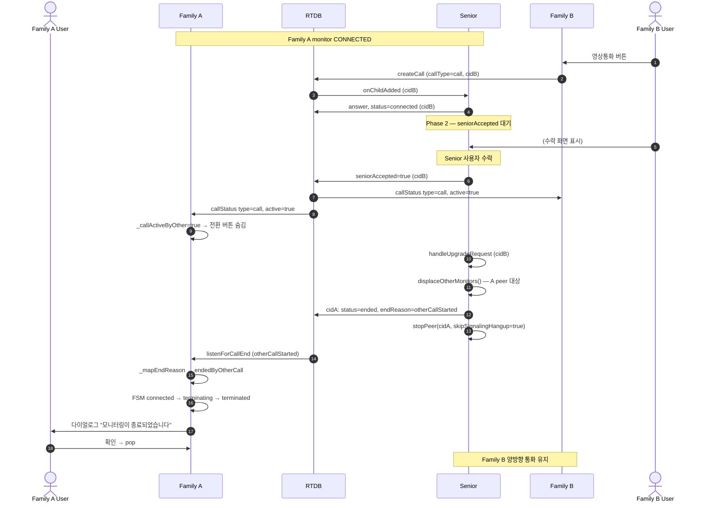

### 13-2. remoteBusy 시퀀스 (Family A call 중 → Family B 시도)

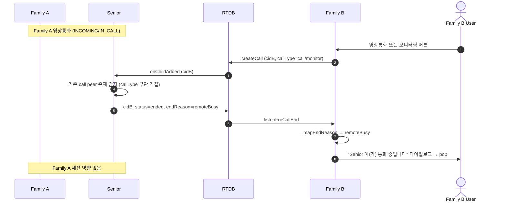

### 13-3. capacityExceeded 시퀀스 (4번째 monitor 시도)

```text
Senior peers 현재 상태: A(monitor) + B(monitor) + C(monitor) = 3
   ↓
Family D (4번째) 가 monitor 발신
   ↓
Senior: peers 카운터 3 ≥ MAX_PEERS → rejectCall(CAPACITY_EXCEEDED)
   ↓
Family D: endReason="capacityExceeded" 수신 → "모니터링 한도 초과" 다이얼로그 → pop
```

→ 단, Family D 가 **call** 발신이면 허용 (일시 peer=4, INCOMING 단계 max 30s). 자세한 내용 §10-3-1 매트릭스.

### 13-4. Family 측 UX 참조

| 상황 | Family UX | 코드 경로 |
|---|---|---|
| Monitor 중 다른 Family call 시작 감지 | "통화 전환" 버튼 숨김 | [monitoring_screen.dart:156-170, 706](../lib/screens/monitoring_screen.dart#L156-L170) `_callActiveByOther` |
| Monitor displace 당함 | 다이얼로그 + pop | [monitoring_screen.dart:395-399](../lib/screens/monitoring_screen.dart#L395-L399) `endedByOtherCall` |
| Call 버튼 활성화 제어 | Senior call 중이면 비활성 | [family_detail_screen.dart:148-149, 744](../lib/screens/family_detail_screen.dart#L148-L149) `_isInCall = active && type=='call'` |
| Monitor 버튼 활성화 | 언제나 (1:N) | [family_detail_screen.dart:745](../lib/screens/family_detail_screen.dart#L745) `canMonitor = _isOnline` |

### 13-5. 관련 회귀 테스트

실기기 실측 시나리오는 [webrtc_integration_test.md §S9~S12 "1:N 정책"](webrtc_integration_test.md) 참조.

---

## 14. Family UX

### 14-1. DISCONNECTED 감지 시 즉시 인지 오버레이

DISCONNECTED 감지 즉시 FSM `reconnecting` 전이 → 오버레이 즉시 표시 (사용자가 즉시 "연결 상태가 좋지 않습니다" 인지).

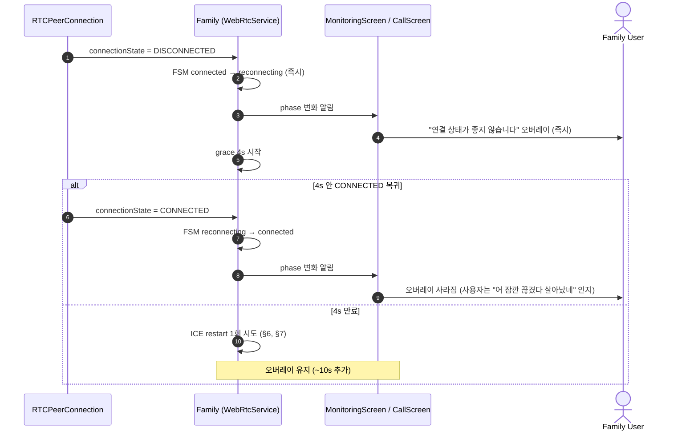

### 14-2. 종결 시 SnackBar + 즉시 pop

`onCallEnded` 콜백 → SnackBar 2s 표시 + 즉시 `Navigator.pop` (사용자 입력 불필요). 14-3 매핑표 참조.

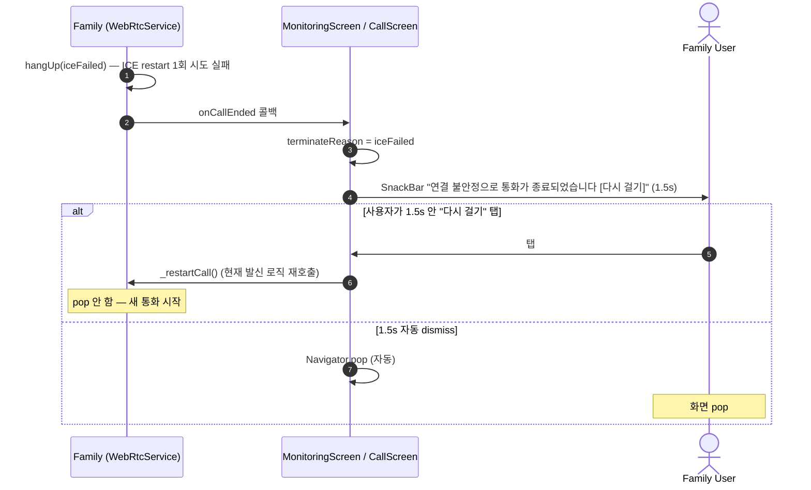

### 14-3. TerminateReason → SnackBar 메시지 / 버튼 매핑

| TerminateReason | SnackBar 메시지 | "다시 걸기" 버튼 | 자동 pop |
|---|---|:---:|:---:|
| `userHangup` (사용자 hangUp 버튼) | (메시지 X) | ✗ | ✅ 즉시 |
| `iceFailed` (ICE restart 1회 실패) | "연결 불안정으로 통화가 종료되었습니다" | ✅ | ✅ 1.5s |
| `remoteEnded` (Senior 종결) | "통화가 종료되었습니다" | ✗ | ✅ 1.5s |
| `remoteBusy` | "상대방이 통화 중입니다" | ✗ | ✅ 1.5s |
| `endedByOtherCall` | "다른 가족이 영상통화를 시작했습니다" | ✗ | ✅ 1.5s |
| `unreachable` | "상대방에게 연결할 수 없습니다" | ✗ | ✅ 1.5s |
| `noAcceptance` | "수신자가 받지 않습니다" | ✗ | ✅ 1.5s |
| `capacityExceeded` | "모니터링 한도 초과" | ✗ | ✅ 1.5s |

### 14-4. KEP drop 떠받침 (사용자 시점)

```text
T+0     KEP wifi 자발적 drop 시작
T+0~1   PC connectionState DISCONNECTED 감지
        → 사용자: "연결 상태가 좋지 않습니다" 오버레이 즉시 표시
T+0~4   grace 4s 동안 PC keepalive 자체 복구 시도
        ├─ 복구 성공 (KEP drop 짧은 경우, ~2.3s) → 오버레이 사라짐, 통화 유지 ✅
        └─ 복구 실패 → ICE restart 1회 시도
T+4~5   ICE restart offer/answer 교환 (~1s)
        → 새 ICE candidate 수집 + CONNECTED 복귀 → 오버레이 사라짐, 통화 유지 ✅
T+4~14  answer 안 옴 (영구 끊김 등) → SnackBar "[다시 걸기]" → pop
        → 사용자가 1탭 재발신 + 시니어 자동수락 → 5초 안에 통화 회복
```

→ 사용자 입장에서 **거의 모든 KEP drop 케이스가 ~5초 안에 자연 회복** + 그 사이 명확한 시각 피드백 ("연결 상태가 좋지 않습니다" 오버레이).
