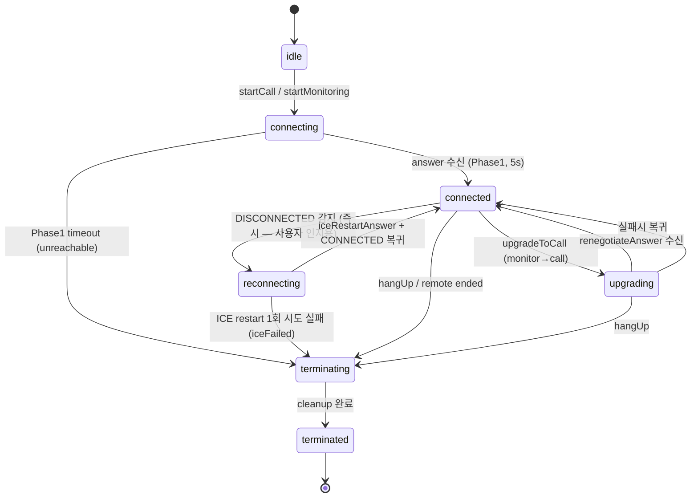
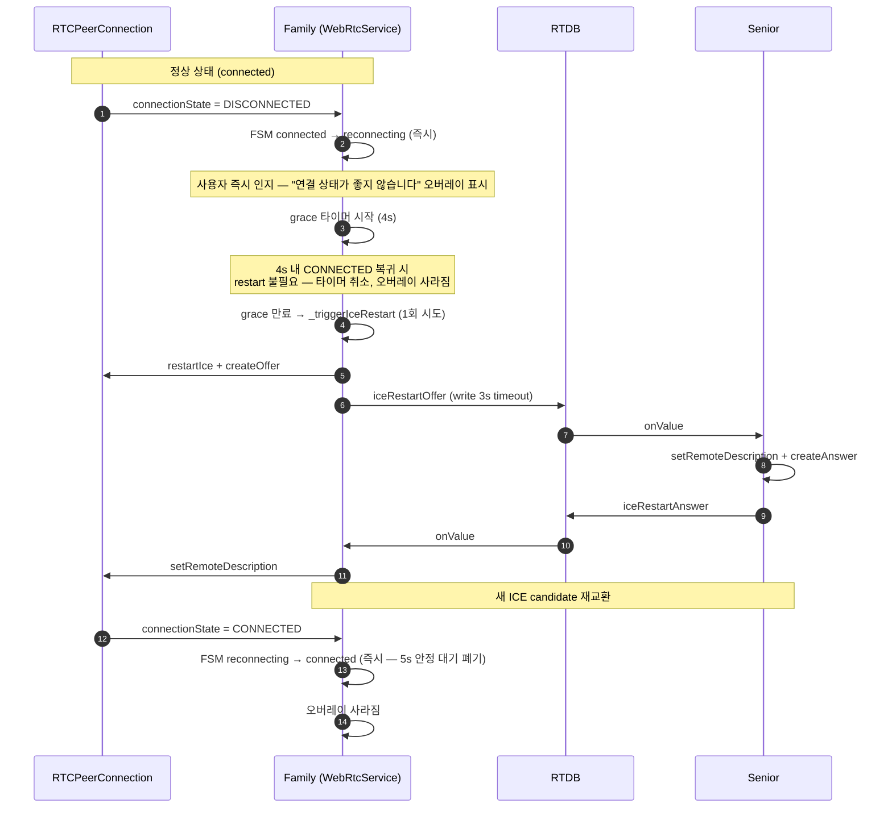
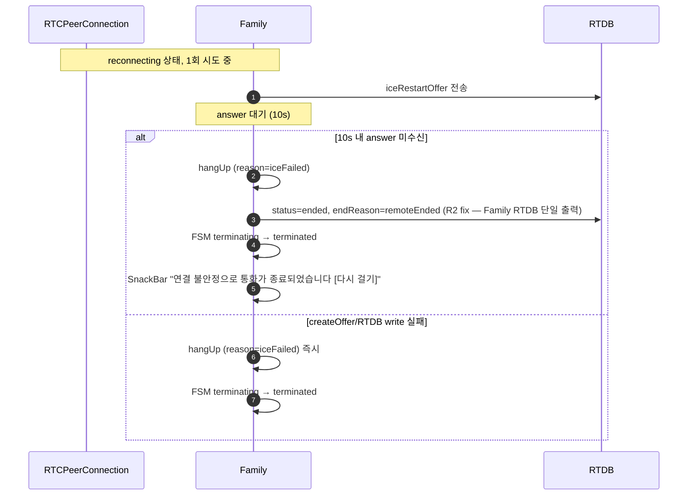
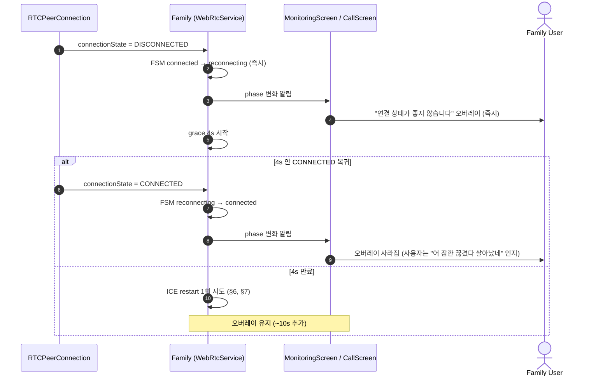
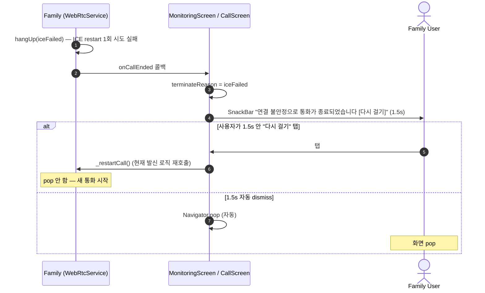

# 영상통화 / 모니터링 시나리오 다이어그램 (Plan Revision 후)

> **Revision 적용 후 구조**: ICE restart 1회 시도 + Family UX 개선 (즉시 인지 오버레이 + 종결 SnackBar + 재발신 버튼). 본 문서는 [tingly-stirring-pine plan](C:\Users\noble\.claude\plans\tingly-stirring-pine.md) 적용 후의 동작을 기준으로 작성.
>
> 변경 영역 (vs [call-scenarios.md](./call-scenarios.md) 원본):
> - §1 FSM 다이어그램 — `reconnecting` 진입 시점 변경 (DISCONNECTED 즉시), `5s 안정` 단계 폐기
> - §6 ICE restart 정상 복구 — `한도 체크`, `5s 안정 후 attempts=0 리셋` 단계 폐기
> - §7 ICE restart 실패 — 재시도 / 한도 / flap window 모두 폐기, **1회 시도 후 즉시 종결**
> - §10 endReason 매트릭스 — `iceFailed` 트리거 조건 단순화 ("flap>60s or attempts≥5" → "1회 시도 실패")
> - §10-4 seniorDisconnect — wording 미세 갱신
> - §12 타임아웃 상수 — `ICE restart 한도 5회 / 60s window` 행 폐기
> - **신규 §14** — Family UX (즉시 인지 오버레이 + 종결 SnackBar + 재발신)
>
> 변경 없는 영역: §2, §3, §4, §5, §8, §9, §10-1, §10-2, §10-3, §11, §13 모두 원본과 동일.

> 시그널링 채널: Firebase RTDB `/calls/{callId}/`
> 구현 경로: [webrtc_service.dart](../lib/services/call/webrtc_service.dart), [signaling_service.dart](../lib/services/call/signaling_service.dart)

---

## 1. FSM 전체 상태 다이어그램 (Revision)



**주요 차이점 (vs 원본 §1)**:
- `connected → reconnecting` 전이가 `DISCONNECTED(4s) / FAILED` → **`DISCONNECTED 감지 즉시`** 로 앞당김 (사용자가 4s grace 동안에도 오버레이 즉시 인지)
- `reconnecting → connected` 전이의 `5s 안정` 조건 폐기 — answer 수신 + CONNECTED 복귀로 즉시 전이
- `reconnecting → terminating` 트리거 변경 — 한도 초과 (5회/60s) 가 아닌 **1회 시도 실패**

---

## 2. 양방향 통화 발신 — Phase 1 (벨 울림)

원본 §2 와 동일. 변경 없음.

---

## 3. 양방향 통화 발신 — Phase 2 (실제 수락)

원본 §3 과 동일. 변경 없음.

---

## 4. CCTV 모니터링 (callType=monitor)

원본 §4 와 동일. 변경 없음.

---

## 5. 모니터링 → 통화 전환 (upgradeToCall)

원본 §5 와 동일. 변경 없음.

---

## 6. ICE Restart — 정상 복구 (Revision)



**주요 차이점 (vs 원본 §6)**:
- `한도 체크 (flap<60s, attempts<5)` 단계 폐기
- `5s 안정 후 attempts=0 리셋` 단계 폐기
- FSM `connected → reconnecting` 전이 시점이 **DISCONNECTED 감지 즉시** (사용자 인지용)
- `_iceRestartAttempts`, `_flapWindowStart`, `_stableTimer` 모두 폐기

**FAILED 상태**: grace 없이 즉시 1회 ICE restart 트리거 (원본과 동일).

---

## 7. ICE Restart — 1회 시도 실패 (Revision)

answer 미수신 또는 createOffer/RTDB write 실패 시 즉시 종결. **재시도 없음**.



**주요 차이점 (vs 원본 §7)**:
- `한도 초과 (attempts≥5 or flap>60s)` 분기 **폐기** — 단일 시도 실패가 곧 종결
- `_iceRestartInProgress = false` 후 **재귀 호출** 분기 **폐기**
- 종결 시 다이얼로그 → SnackBar 1.5s + "다시 걸기" 버튼 (§14 참조)

구현: [webrtc_service.dart `_triggerIceRestart`](../lib/services/call/webrtc_service.dart) (~30줄, 단순화 후)

---

## 8. 비정상 종료 — 앱 크래시 / 네트워크 끊김

원본 §8 과 동일. 변경 없음. Family `setCallCleanupOnDisconnect` 정책 `.remove()` 그대로 유지.

---

## 9. 비정상 종료 — Senior 측 종료 감지

원본 §9 와 동일. 변경 없음.

---

## 10. 종료 사유(endReason) 매트릭스 (Revision)

> ⚠️ **TerminateReason ≠ RTDB endReason**: 본 표의 행 중 일부는 Family `TerminateReason` (Dart enum, 메모리 안에서만) 이고, 일부는 RTDB `/calls/{cid}/endReason` string 값. "RTDB 도달" 컬럼으로 구분. Family 가 RTDB 에 실제로 쓰는 endReason 은 **`"remoteEnded"` 한 가지만** (R2 fix 이후).

| endReason | RTDB 도달 | RTDB Writer | 트리거 (Revision) | FSM 경유 | UI 메시지 |
| --------- | :---: | --- | ------ | -------- | --------- |
| `normal` | ✅ | Senior `markEnded`/`hangUp` | Senior 사용자 명시적 hangUp | terminating | 통화 종료 |
| `unreachable` | ❌ | (Family 내부 enum 만) | Phase 1 timeout (5s) | connecting→terminating | 응답 없음 |
| `noAcceptance` | ❌ | (Family 내부 enum 만) | Phase 2 timeout (20s) | connected→terminating | 수신자가 받지 않음 |
| **`iceFailed`** | ❌ | (Family 내부 enum 만) | **ICE restart 1회 시도 실패** (answer 10s 미수신 또는 createOffer/RTDB write 실패) | reconnecting→terminating | **"연결 불안정으로 통화가 종료되었습니다" SnackBar + "다시 걸기"** |
| `remoteEnded` | ✅ | Family `endCall` (R2 fix) — 모든 Family 측 종결의 단일 RTDB 값 | Family 측이 종결 (사용자 hangUp / iceFailed / 등 어떤 내부 사유든) | connected→terminating | 상대방이 종료 |
| `remoteBusy` | ✅ | Senior `rejectCall` | Senior 다른 통화 중 | connecting→terminating | 통화 중 |
| `capacityExceeded` | ✅ | Senior `rejectCall` | Senior MAX_PEERS(3) 초과 | connecting→terminating | 모니터링 한도 초과 |
| `otherCallStarted` | ✅ | Senior `rejectCall` | 모니터링 중 Senior 가 call 수락 → displace | connected→terminating | 모니터링이 종료되었습니다 |
| ~~`seniorDisconnect`~~ | ❌ (Plan B 폐기) | Server-side onDisconnect (S16 fix, Plan A 까지) | Plan B 에서 `hasFlapMarker` 별도 필드로 대체. status 안 건드림. | — | — |
| `hasFlapMarker` (필드, Plan B) | ✅ | Server-side onDisconnect (양측) | Family/Senior wifi 끊김 시 자동 set. status 무관. | 별도 listener 가 grace 분기 — PC=CONNECTED 면 자기 마커 clear, ≠CONNECTED 면 상대 wifi flap → grace 진입 | (UI 변경 없음) |
| `userHangup`, `networkOffline`, `upgradeFailed`, `endedByOtherCall` | ❌ | (Family 내부 enum 만) | 다양 — Family `_mapEndReason` 또는 자체 hangUp reason | 다양 | 다양 |

**주요 차이점 (vs 원본 §10)**:
- `iceFailed` 트리거 조건 단순화: "flap>60s or attempts≥5" → **"1회 시도 실패"**
- `iceFailed` UI 메시지 변경: 기존 "연결 실패" 다이얼로그 → **SnackBar 1.5s + "다시 걸기" action 버튼**
- 명칭 그대로 유지 (`networkLost` 또는 `terminating` 으로 변경 안 함 — FSM phase 와의 충돌 / over-broad 우려)

### 10-1, 10-2, 10-3 (otherCallStarted, remoteBusy, capacityExceeded)

원본 §10-1, §10-2, §10-3 과 동일. 변경 없음.

### 10-4. `hasFlapMarker` 상세 (Plan B — wifi flap 신호 별도 필드)

**Plan B 핵심 변경**: Plan A 의 `endReason="familyDisconnect"`/`"seniorDisconnect"` 마커 폐기 →
`hasFlapMarker=true` 별도 필드 도입. `status` 는 정상 종결만 변경 → 모든 listener 가
endReason 분기 없이 처리 가능 (race 폭발 해결).

**발생 조건**:
- Family 또는 Senior wifi 끊김 → Firebase server-side onDisconnect 가 `hasFlapMarker=true` 자동 set.

**Family 동작** ([webrtc_service.dart](../lib/services/call/webrtc_service.dart)):

신규 `_flapMarkerSub` 리스너가 hasFlapMarker 변경 감지 → PC connectionState 기반 자기/상대 마커 구분.

- **PC=CONNECTED**: 자기 마커 추정 (wifi 복귀 후 자기가 set 한 마커가 RTDB 에서 도달).
  → `clearFlapMarker(callId)` + `setCallCleanupOnDisconnect(callId)` (재등록).
- **PC≠CONNECTED**: 상대 (Senior) wifi flap 추정.
  → 별도 timer 안 둠 — PC keepalive 가 곧 끊김 인지 → `_onPeerConnectionStateChanged` →
    grace 4s + ICE restart 1회 시도 자체 흐름 위임.

**Senior 동작** ([MonitoringSession.kt](../../Senior/app/src/main/java/com/seniorcare/senior/call/MonitoringSession.kt)):

신규 `listenForFlapMarker` 리스너가 hasFlapMarker 변경 감지 → 동일 PC state 분기.

- **PC=CONNECTED**: 자기 마커 → clear + onDisconnect 재등록 (`registerDisconnectCleanup` 재호출).
- **PC≠CONNECTED**: 상대 (Family) wifi flap → `scheduleStopPeer(callId, STOP_DELAY_MS=7s)`. ICE restart offer 도착 시 cancel.

**복구 가능 한계**:
- Family wifi off **1~6초** [모니터링/영상통화]: ICE restart 1회 시도로 복구 (떠받침)
- Family wifi off **15초+**: Family ICE restart 시점 wifi 아직 off → networkLost 정상 종결
- Senior wifi off **1~4초**: ICE restart 1회 시도로 복구 (떠받침)
- Senior wifi off **5초+**: Senior PC keepalive timeout + STOP_DELAY 7s 만료 → networkLost 정상 종결

**Plan A 대비 race 해결**:
- 영상통화 1→2 전이 시 race (S13) — Plan A 에서는 status="ended" + endReason="familyDisconnect" 마커가
  upgradeToCall 의 RTDB write 를 막아서 noAcceptance 종결 발생. Plan B 는 status="active" 그대로 유지 →
  upgrade 정상 진행 → race 사라짐.
- 사용자 hangup 시 Senior 가 늦게 종결되던 race — Plan A 에서는 active 복원 비동기 vs hangup 동시 race.
  Plan B 는 status 자체 안 건드리니 복원 불필요 → race 사라짐.

검증 결과는 [ICE_restart_test_result.md](./ICE_restart_test_result.md) 참조.

---

## 11. RTDB `/calls/{callId}/` 필드 요약

원본 §11 과 동일. 변경 없음.

```text
/calls/{callId}/
├── offer                   SDP offer (Family 작성)
├── answer                  SDP answer (Senior 작성)
├── status                  ringing | connected | ended
├── callType                call | monitor
├── endReason               위 매트릭스 참조
├── targetDeviceId          Senior 기기 ANDROID_ID
├── targetFamilyId          가족 그룹 ID
├── callerUid               Family 사용자 UID
├── callerName              표시 이름
├── createdAt               ServerValue.timestamp
├── seniorAccepted          Phase 2 수락 플래그 (call only)
├── upgradeRequest          call (monitor→call 전환)
├── renegotiateOffer        SDP (upgrade)
├── renegotiateAnswer       SDP (upgrade 응답)
├── iceRestartOffer         SDP (ICE restart, 1회 시도)
├── iceRestartAnswer        SDP (ICE restart 응답)
├── callerCandidates/{push} candidate, sdpMid, sdpMLineIndex
└── calleeCandidates/{push} candidate, sdpMid, sdpMLineIndex
```

종료 정리: `status=ended` 기록 후 10초 지연 → 노드 delete.

---

## 12. 타임아웃 상수 (Revision)

| 상수 | 값 | 위치 |
| ---- | -- | ---- |
| Phase 1 (answer 대기) | 5s | `startCall` / `startMonitoring` |
| Phase 2 (seniorAccepted 대기) | 20s | `_listenForSeniorAccepted` |
| DISCONNECTED grace | 4s | `_disconnectTimer` (`_graceMs`) |
| ICE restart answer 대기 | 10s | `_iceRestartAnswerTimeoutMs` |
| **~~ICE restart 한도 5회 / 60s window~~** | ~~5회 / 60s~~ | **폐기** (1회 시도 정책) |
| Senior disconnect grace (S16) | 15s | `_seniorDisconnectGraceMs` |
| 종결 SnackBar duration | 1.5s | `_onCallEnded` (신규 — §14 참조) |
| 종료 후 노드 정리 | 10s | `hangUp` (fire-and-forget) |
| RTDB write timeout | 3s | `writeOrTimeout` (NetworkGuard) |
| Senior monitor peer 상한 | 3 (`MAX_PEERS`) | Senior `MonitoringSession` |
| Senior STOP_DELAY (RESTARTING 중) | 7s (현재 값) | Senior `MonitoringSession.STOP_DELAY_MS` |

**주요 차이점 (vs 원본 §12)**:
- `ICE restart 한도 5회 / 60s window` 행 **폐기** (`_maxIceRestartAttempts`, `_maxFlapWindowMs` 자체 사라짐)
- 신규 행: `종결 SnackBar duration 1.5s`
- Senior STOP_DELAY 값 정정: 원본 15s → 실제 7s (commit 9b308f7 에서 단축됨)

---

## 13. 1:N × 1:1 정책 흐름

원본 §13 (전체 — 13-1, 13-2, 13-3, 13-4, 13-5) 과 동일. 변경 없음.

---

## 14. Family UX (Revision 신규 섹션)

### 14-1. DISCONNECTED 감지 시 즉시 인지 오버레이

**현재 (원본)**:
- DISCONNECTED 감지 → grace 4s 시작 → 만료 후 ICE restart 시작 시점에 FSM `reconnecting` 전이 → 오버레이 표시
- 사용자가 "연결 상태 안 좋다" 인지하기까지 4s+ 지연

**Revision 후**:
- DISCONNECTED 감지 즉시 FSM `reconnecting` 전이 → 오버레이 즉시 표시
- 사용자가 즉시 "연결 상태가 좋지 않습니다" 인지



### 14-2. 종결 시 SnackBar + "다시 걸기" 버튼

**현재 (원본)**:
- `onCallEnded` 콜백 → `_showDialog(message)` → 사용자가 확인 탭 → pop
- 사용자 입력 필요 (탭)

**Revision 후**:
- `onCallEnded` 콜백 → SnackBar 1.5s 자동 dismiss + action 버튼 → 1.5s 후 자동 pop
- 사용자 입력 불필요. networkLost 케이스만 "다시 걸기" 버튼 표시



### 14-3. TerminateReason → SnackBar 메시지 / 버튼 매핑

| TerminateReason | SnackBar 메시지 | "다시 걸기" 버튼 | 자동 pop |
|---|---|:---:|:---:|
| `userHangup` (사용자 hangUp 버튼) | (메시지 X) | ✗ | ✅ 즉시 |
| `iceFailed` (ICE restart 1회 실패) | "연결 불안정으로 통화가 종료되었습니다" | ✅ | ✅ 1.5s |
| `remoteEnded` (Senior 종결) | "통화가 종료되었습니다" | ✗ | ✅ 1.5s |
| `remoteBusy` | "상대방이 통화 중입니다" | ✗ | ✅ 1.5s |
| `endedByOtherCall` | "다른 가족이 영상통화를 시작했습니다" | ✗ | ✅ 1.5s |
| `unreachable` | "상대방에게 연결할 수 없습니다" | ✗ | ✅ 1.5s |
| `noAcceptance` | "수신자가 받지 않습니다" | ✗ | ✅ 1.5s |
| `capacityExceeded` | "모니터링 한도 초과" | ✗ | ✅ 1.5s |

### 14-4. KEP drop 떠받침 (사용자 시점)

```text
T+0     KEP wifi 자발적 drop 시작
T+0~1   PC connectionState DISCONNECTED 감지
        → 사용자: "연결 상태가 좋지 않습니다" 오버레이 즉시 표시
T+0~4   grace 4s 동안 PC keepalive 자체 복구 시도
        ├─ 복구 성공 (KEP drop 짧은 경우, ~2.3s) → 오버레이 사라짐, 통화 유지 ✅
        └─ 복구 실패 → ICE restart 1회 시도
T+4~5   ICE restart offer/answer 교환 (~1s)
        → 새 ICE candidate 수집 + CONNECTED 복귀 → 오버레이 사라짐, 통화 유지 ✅
T+4~14  answer 안 옴 (영구 끊김 등) → SnackBar "[다시 걸기]" → pop
        → 사용자가 1탭 재발신 + 시니어 자동수락 → 5초 안에 통화 회복
```

→ 사용자 입장에서 **거의 모든 KEP drop 케이스가 ~5초 안에 자연 회복** + 그 사이 명확한 시각 피드백 ("연결 상태가 좋지 않습니다" 오버레이).

---

## Appendix — 변경 요약 vs 원본

| 영역 | 원본 | Revision |
|---|---|---|
| FSM `reconnecting` 진입 | DISCONNECTED 4s grace 후 (ICE restart 시작 시) | DISCONNECTED 즉시 (사용자 인지용) |
| FSM `reconnecting → connected` | answer 수신 + 5s 안정 | answer 수신 + CONNECTED 복귀 즉시 |
| ICE restart 시도 횟수 | 5회 (60s flap window 내) | **1회** |
| ICE restart 실패 시 | 한도 체크 → 재시도 또는 종결 | **즉시 종결** (재시도 0) |
| `_iceRestartAttempts`, `_flapWindowStart`, `_stableTimer` | 사용 | **폐기** |
| `_maxIceRestartAttempts`, `_maxFlapWindowMs`, `_stableResetMs` | 5 / 60000 / 5000 | **폐기** |
| TerminateReason 명칭 | `iceFailed` | `iceFailed` (그대로 유지) |
| 종결 UX | 다이얼로그 (사용자 탭 확인) | SnackBar 1.5s + "다시 걸기" 버튼 + 자동 pop |
| Senior 측 코드 | (현행) | **변경 없음** (handleIceRestartOffer, S16 fix, R2 fix 모두 그대로) |
| RTDB 스키마 (iceRestartOffer/Answer) | (현행) | **변경 없음** |
| CF stub cleanup | (현행) | **변경 없음** |

**순 효과**:
- Family 코드 ~150줄 제거 + ~40줄 신규 + UI ~30줄 변경 = 약 110줄 net 감소
- ICE restart 의 본 가치 (KEP drop 떠받침) 보존
- 사용자 UX 명확 개선 (즉시 인지 + 빠른 종결 + 재발신 1탭)
- Senior 측 변경 0
