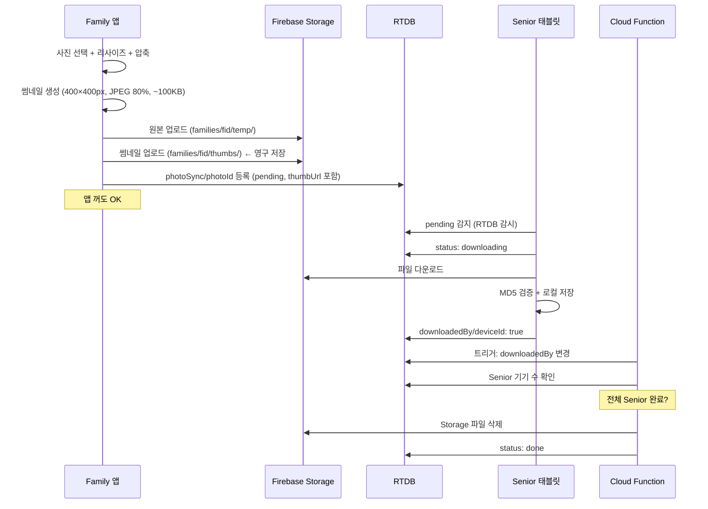
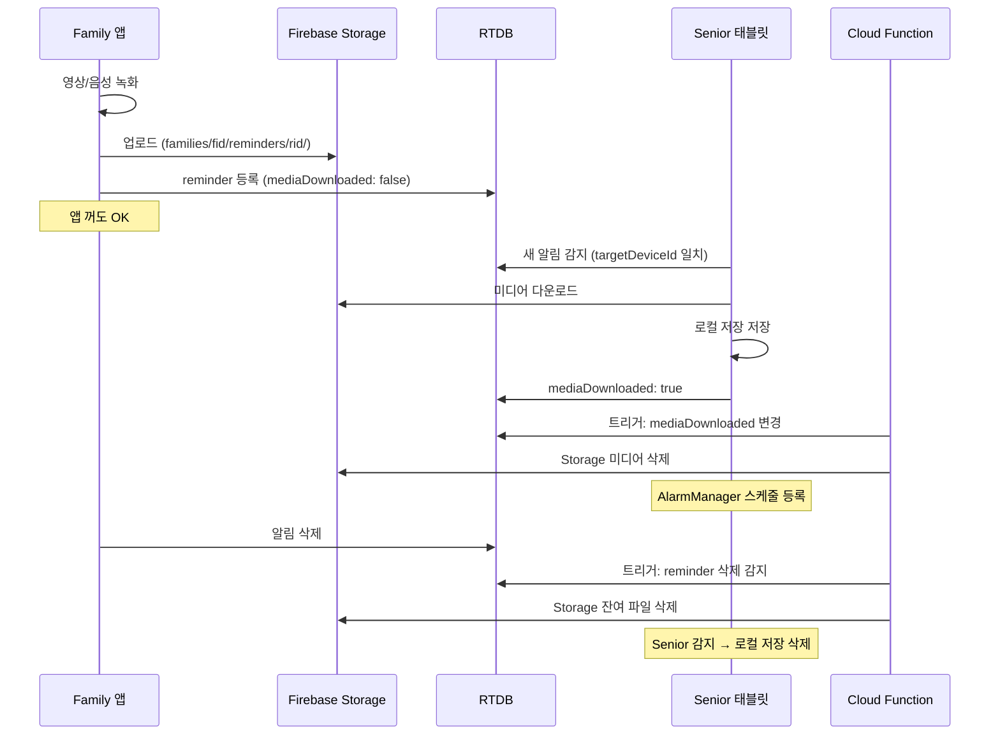
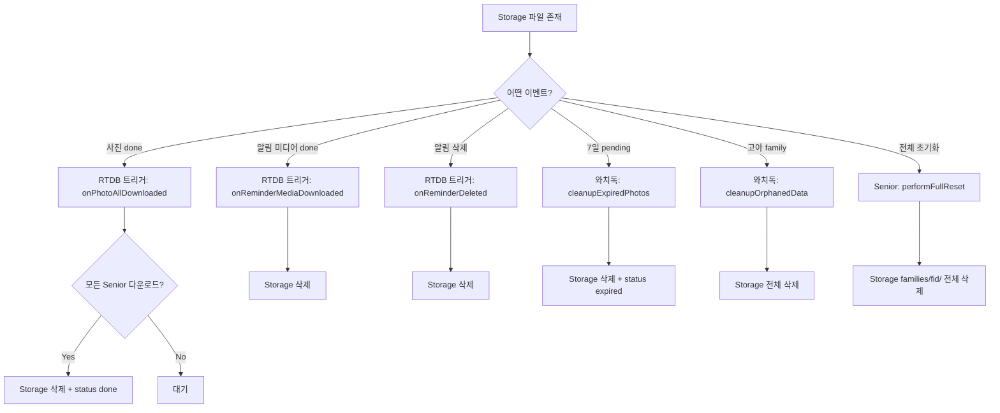
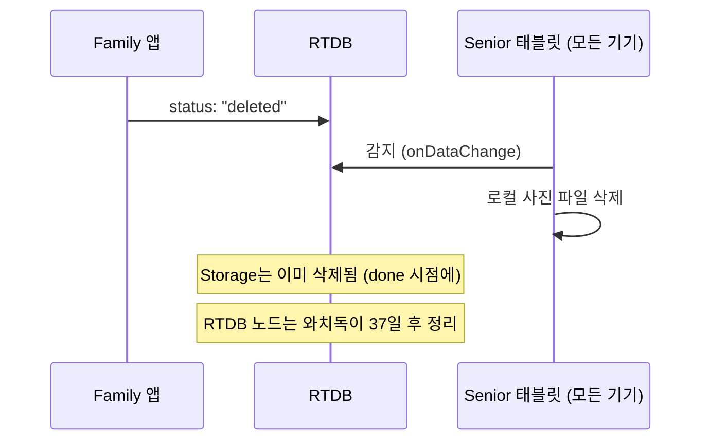
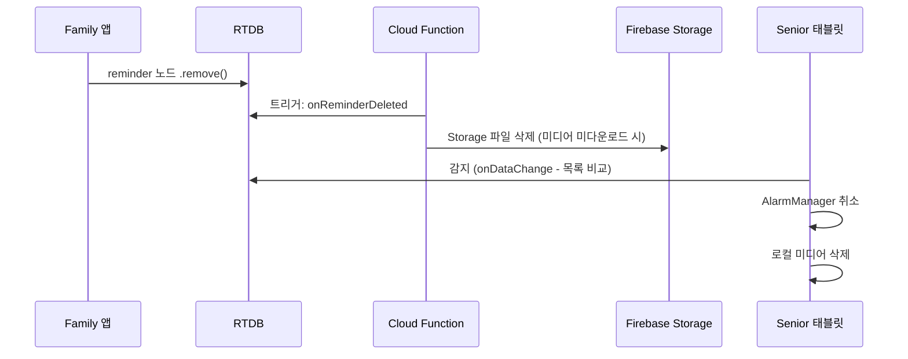
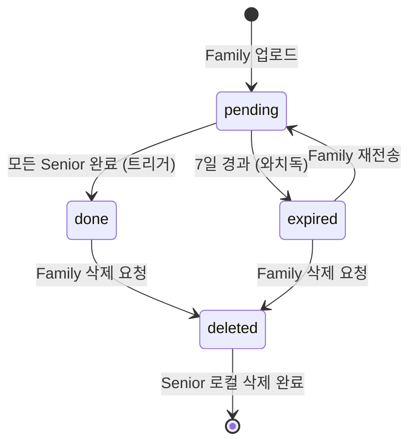

# 미디어 전송 설계 (사진 + 알림 미디어)

## 개요

Family 앱 → Firebase Storage (임시 버퍼) → Senior 태블릿 로컬 저장.
RTDB로 전송 큐/상태 관리. 모든 Senior 다운로드 완료 시 Cloud Function이 Storage 자동 삭제.
영구 저장은 태블릿 로컬에만. 썸네일만 Storage에 영구 보관 (Family 앱 표시용).

**사진과 알림 미디어 모두 동일한 임시 버퍼 패턴 사용.**

- **사진**: 가족 단위 — 같은 가족의 모든 Senior가 수신
- **알림 미디어**: 기기 단위 — targetDeviceId로 지정된 Senior만 수신

## 왜 임시 버퍼 방식인가

### Firebase Storage 영구 저장의 문제

- 1000명 × 20GB = 20TB 상시 저장 → 연 200~810만원
- 온프레미스 없는 스타트업에겐 치명적 비용

### P2P 직접 전송 (DataChannel)의 문제

- 양쪽 다 온라인이어야 전송 가능
- iOS 백그라운드에서 WebRTC 유지 불가 (즉시 Suspended)
- 딸이 밤에 보냄 → 태블릿 슬립 → 전송 불가

### 임시 버퍼 방식 (채택)

- Storage를 택배 창고처럼 사용: 보관이 아닌 전달 목적
- Senior가 다운로드하면 Cloud Function이 Storage에서 삭제 → 상시 저장량 거의 0
- iOS에서도 HTTP 업로드는 백그라운드 가능 (NSURLSession)

| 비교 | 상시 저장량 | 월 비용 |
| ---- | ---------- | ------- |
| 영구 저장 20GB | 20TB | $520 |
| P2P 직접 전송 | 0 | $0 (UX 나쁨) |
| **임시 버퍼** | ~수백 MB | **~$0.01** |

---

## 아키텍처

### 사진 (가족단위)



### 알림 미디어 (기기단위)



---

## Firebase Storage 경로

```text
families/{familyId}/
  temp/
    {photoId}.jpg                         # 사진 원본 (임시, Senior 다운로드 후 삭제)
  thumbs/
    {photoId}.jpg                         # 사진 썸네일 400×400px (영구, Family 앱 표시용)
  reminders/
    {reminderId}/
      {제목}_{생성자}_{날짜}.mp4          # 알림 영상 (임시, 다운로드 후 삭제)
      {제목}_{생성자}_{날짜}.m4a          # 알림 음성 (임시, 다운로드 후 삭제)
```

파일명 예시:
- `photo_딸_20260317_143052.jpg`
- `혈압약오전_딸_20260317.mp4`

---

## RTDB 구조

### 사진

```text
/families/{familyId}/photoSync/
  {photoId}/
    _label: string              # "photo_딸_20260317.jpg (pending, 딸)"
    fileName: string            # "photo_딸_20260317_143052.jpg"
    size: number                # 바이트
    checksum: string            # MD5 해시
    storageUrl: string          # 원본 임시 Storage URL (done 후 필드 제거됨)
    storagePath: string         # 원본 임시 Storage 경로 (삭제용, done 후 필드 제거됨)
    thumbUrl: string            # 썸네일 영구 Storage URL (Family 앱 표시용)
    thumbPath: string           # 썸네일 Storage 경로 (사진 삭제 시 Cloud Function이 삭제)
    uploadedBy: string          # userId
    uploadedByName: string      # "딸"
    createdAt: timestamp
    status: string              # "pending" | "done" | "expired" | "deleted"
    retryCount: number          # 실패 시 증가
    downloadedBy/               # 각 Senior 다운로드 완료 기록
      {deviceId}: true

※ thumbnail(base64) 필드 없음 → thumbUrl(Storage URL)로 대체
※ Family 앱은 onChildAdded/Changed/Removed로 구독 (onValue 사용하지 않음)
※ 앱 재시작 시 onChildAdded가 기존 항목 replay + RTDB offline persistence 로컬 캐시
```

### 알림

```text
/families/{familyId}/reminders/
  {reminderId}/
    _label: string              # "혈압약오전 (매일 08:00)"
    title: string
    mediaUrl: string            # Storage 다운로드 URL
    mediaType: "video" | "audio"
    mediaDuration: number       # 초
    mediaDownloaded: boolean    # Senior 다운로드 완료 여부
    targetDeviceId: string      # 대상 Senior 기기 (null = 전체)
    schedule:
      time: "08:00"
      repeat: "daily" | "weekdays" | "weekend" | "custom" | "test_5min"
      days: [1,3,5]
    enabled: boolean
    createdBy: string
    createdByName: string
    createdAt: timestamp
    updatedAt: timestamp
```

---

## Storage 삭제 흐름

### 원칙

- **앱에서 Storage 직접 삭제하지 않음** (Senior는 Auth 없어서 권한 없음)
- **Cloud Function이 RTDB 트리거로 자동 삭제** (일관성)
- **와치독이 보험으로 정리** (트리거 실패, 비정상 종료 등 대비)



- 사진: Senior 1대 가족이면 1대 done → 즉시 삭제. 2대면 2대 모두 done → 삭제.
- 알림 미디어: targetDevice 1대 다운로드 완료 → 즉시 삭제.
- 전체 초기화: Storage + 로컬 + RTDB 전부 삭제.

---

## 전송 흐름

### 1. Family 앱에서 사진 업로드

```text
사진 선택 → 리사이즈 (긴 변 maxResolution px 이하)
         → JPEG 압축 (quality%)
         → 썸네일 생성 (400×400px, JPEG 80%, ~100KB)
         → MD5 체크섬 계산
         → Storage 업로드 ①: 원본 → families/{fid}/temp/{photoId}.jpg (임시)
         → Storage 업로드 ②: 썸네일 → families/{fid}/thumbs/{photoId}.jpg (영구)
         → thumbUrl = getDownloadURL()
         → RTDB photoSync/{photoId} 메타 등록 (status: "pending", thumbUrl 포함)
```

### 2. Senior 태블릿 수신 (복수대 지원)

```text
RTDB photoSync 감시 → status: "pending" 감지
  → downloadedBy/{자기 deviceId} 존재 확인
  → 이미 있으면 → 무시 (이미 받음)
  → 없으면 → storageUrl에서 파일 다운로드
  → MD5 검증
  → 성공: 로컬 저장 → downloadedBy/{deviceId}: true 기록
  → 실패: retryCount++ (재시도)

※ status를 "downloading"으로 변경하지 않음 — 복수 Senior가 동시에 다운로드 가능
※ Cloud Function(onPhotoDownloaded)이 모든 Senior 완료 확인 후 status: "done" + Storage 삭제
```

### 3. 만료 처리

```text
Cloud Function (와치독, 매일):
  → 7일 경과 + status: "pending" → Storage 파일 삭제 → status: "expired"
  → Family 앱에서 "만료" 표시 + 재전송 버튼 제공
```

### 4. 사진 삭제 (Family → Senior)



- Family는 RTDB `status`만 변경 — Storage 직접 삭제 안 함
- 모든 Senior가 각자 감지해서 로컬 파일 삭제

---

## 알림 미디어 전송 흐름

### 1. Family 앱에서 알림 생성

```text
영상/음성 녹화 → Firebase Storage 업로드
  (families/{fid}/reminders/{rid}/{rid}.mp4)
→ RTDB에 알림 등록 (mediaUrl, mediaDownloaded: false, targetDeviceId)
```

### 2. Senior 태블릿 수신

```text
RTDB reminders 감시 → 새 알림 + enabled + mediaDownloaded == false
  → mediaUrl에서 다운로드 → 로컬 저장 (filesDir/reminders/{rid}.mp4)
  → mediaDownloaded: true 기록 → Cloud Function 트리거 → Storage 삭제
  → AlarmManager 스케줄 등록
```

### 3. 알림 삭제 (Family → Senior)



- Family는 RTDB 노드만 삭제 — Storage 직접 삭제 안 함
- Cloud Function이 Storage 정리 (이미 다운로드됐으면 Storage에 없으므로 무시)
- Senior는 이전 목록과 비교해서 사라진 알림 감지 → 알람 취소 + 로컬 삭제

### 4. 알림 비활성/활성 토글

```text
Family에서 enabled: false → Senior 감지 → 알람만 취소 (로컬 미디어 유지)
Family에서 enabled: true  → Senior 감지 → 알람 재등록 (로컬 미디어 재사용)
```

- 비활성 시 미디어를 삭제하지 않음 — 재활성 시 재다운로드 불필요
- Storage에서 이미 삭제된 상태라 재다운로드도 불가능

---

## 수신 확인 (ACK)

### 사진 상태 전이



| status | 누가 씀 | 설명 |
|--------|---------|------|
| `pending` | Family | 업로드 완료, Senior 다운로드 대기 |
| `done` | Cloud Function | 모든 Senior의 downloadedBy 확인 후 설정 |
| `expired` | Cloud Function | 7일 경과 미수신 (와치독) |
| `deleted` | Family | 삭제 요청 |

※ `downloading` 상태는 더 이상 사용하지 않음 — 복수 Senior 동시 다운로드를 위해
※ 각 Senior의 다운로드 상태는 `downloadedBy/{deviceId}: true`로 개별 추적

### 알림 미디어

| 상태 | 누가 씀 |
|------|---------|
| `mediaDownloaded: false` | Family |
| `mediaDownloaded: true` | Senior |

---

## 전송 상태 UI (사진)

| status | 아이콘 | 색상 | 텍스트 | 액션 |
| ------ | ------ | ---- | ------ | ---- |
| `pending` | `Icons.schedule` | 회색 | 대기 중 (2/3 수신) | - |
| `done` | `Icons.check_circle` | 초록 | 완료 | 삭제 가능 |
| `expired` | `Icons.error_outline` | 빨강 | 만료 | 재전송 버튼 |
| `deleted` | - | - | 목록에서 제거 | - |

※ pending 상태에서 `downloadedBy` 수를 표시하여 수신 진행률 확인 가능

---

## Cloud Functions 목록

| 함수명 | 트리거 | 역할 |
| ------ | ------ | ---- |
| `onPhotoAllDownloaded` | RTDB `downloadedBy/{did}` write | 모든 Senior 다운로드 완료 → 원본 Storage 삭제 + status: done (thumbs는 유지) |
| `onPhotoDeleted` | RTDB `photoSync/{photoId}/status` update | status→deleted 즉시 → 썸네일 Storage 삭제 (1:N Family 구조 일관 처리) |
| `onReminderMediaDownloaded` | RTDB `mediaDownloaded` update | targetDevice 다운로드 완료 → Storage 삭제 |
| `onReminderDeleted` | RTDB `reminders/{rid}` delete | 알림 삭제 → Storage 파일 삭제 |
| `cleanupExpiredPhotos` | 스케줄 6시간 | 만료/done 정리 + thumbPath도 함께 삭제 |
| `cleanupOrphanedData` | 스케줄 매일 3시 | 고아 RTDB + Storage 정리 |

---

## 디바이스 프로필

`assets/device_profiles/{model}.json`으로 태블릿별 스펙 관리.

```json
{
  "model": "SM-T500",
  "name": "Galaxy Tab A7",
  "display": {
    "width": 2000,
    "height": 1200,
    "density": 224
  },
  "photo": {
    "maxResolution": 2000,
    "jpegQuality": 80
  },
  "storage": {
    "maxPhotos": 500,
    "maxTotalMB": 5000
  }
}
```

---

## 썸네일

### 목적

- 가족 구성원 누구나 "어떤 사진이 보내졌는지" 확인 가능
- 원본은 Senior 태블릿 로컬에만 존재, 썸네일은 Firebase Storage에 영구 보관

### 생성 (Family 앱, 업로드 시)

```text
원본 사진 → 400×400px 리사이즈 → JPEG quality 80% → Storage 업로드 → URL을 RTDB에 저장
```

- `flutter_image_compress`로 처리
- 결과: ~100KB/장 (Storage URL 문자열만 RTDB에 저장, ~200bytes)
- RTDB에 base64 저장하지 않음 (비용 절감 핵심)

### Family 앱 표시

- `cached_network_image` 패키지 사용
- 최초 1회 다운로드 후 앱 캐시 디렉토리에 저장 (LRU 200MB / 30일 자동 만료)
- photoId가 Firebase push key (불변)이므로 URL 변경 없음 → 캐시 무효화 불필요
- 사진 삭제 시: `CachedNetworkImage.evictFromCache(thumbUrl)` (LRU가 자동 처리하므로 선택적)

### 삭제

- Cloud Function이 사진 삭제/만료 시 `families/{fid}/thumbs/{photoId}.jpg` 도 함께 삭제

### Family 앱 RTDB 오프라인 캐시

**`setPersistenceEnabled(true)`** — `main.dart` Firebase 초기화 직후 1회 호출
- RTDB 수신 데이터를 기기 내부 SQLite DB에 저장 (`/data/data/{패키지명}/databases/`)
- 앱 재시작 시 네트워크 연결 전에 로컬 캐시에서 UI 즉시 표시
- 온라인 복귀 시 변경분만 sync (전체 재수신 없음)
- 기본 캐시 크기: 10MB (photoSync는 URL만이라 ~0.5MB 수준)

**`keepSynced(true)`** — `family_detail_screen.dart` initState에서 familyId 확정 후 호출
- `families/{fid}/photoSync` 노드를 앱 실행 중 항상 최신 상태로 유지
- 화면 재진입 시 로컬 캐시에서 즉시 표시 + 변경분만 수신
- 앱 재시작 시 `onChildAdded`가 기존 항목 모두 replay → 기기 캐시 이미지와 결합해 즉시 표시

| 상황        | persistence 없음                  | persistence + keepSynced  |
| ----------- | --------------------------------- | ------------------------- |
| 앱 재시작   | onChildAdded replay 기다려야 표시 | 로컬 캐시에서 즉시 표시   |
| 화면 재진입 | 다시 구독 → 전체 replay           | 즉시 표시                 |
| 오프라인    | 빈 화면                           | 마지막 상태 표시          |
| 온라인 복귀 | 전체 replay                       | 변경분만 sync             |

---

## 이미지 압축 전략

| 원본 | 리사이즈 | JPEG 압축 후 | 절감률 |
| ---- | -------- | ------------ | ------ |
| 4000×3000 (5MB) | 2000×1500 | ~300KB | 94% |
| 3000×2000 (3MB) | 2000×1333 | ~250KB | 92% |
| 1920×1080 (2MB) | 그대로 | ~200KB | 90% |

---

## 오프라인 대응

1. Family 앱: Storage 업로드 + RTDB pending 등록 → 앱 꺼도 OK
2. Senior 오프라인: 다음 온라인 시 RTDB에서 pending 목록 자동 감지 → 다운로드
3. 7일 초과 미수신: Cloud Function이 Storage 삭제 + status: "expired"
4. Family에서 재전송 버튼으로 다시 업로드 가능

---

## 비용 (5000명 기준, 가족당 100장/월)

| 항목 | 계산 | 월 비용 |
| ---- | ---- | ------- |
| RTDB: onChildAdded (URL만, ~200bytes) | 5000명×100장×200bytes = 0.1GB | ~$0 |
| RTDB: 앱 재시작 replay | 5000명×2.5회/일×500장×200bytes×30일 = 375MB | ~$0 |
| Storage: 썸네일 영구 저장 (500장) | 5000명×500장×100KB = 250GB | ~$7.5 |
| Storage: 썸네일 최초 다운 (캐시 미스) | 5000명×100장×100KB = 50GB | ~$6 |
| Storage: 원본 임시 버퍼 (전달 후 삭제) | 가족당 100장×800KB | ~$47 |
| Cloud Functions 트리거 | ~$0 (무료 200만 호출/월) | ~$0 |
| **합계** | | **~$66/월** |

> 원본 사진 전달($47)이 최대 비용. RTDB는 무료 구간 내.
> `cached_network_image` 기기 캐시 덕분에 썸네일 재다운 최소화.
> 최적화 전 (onValue + base64): 5000명 기준 ~$18,750/월

---

## 구현 파일

### Family 앱 (Flutter)

- `lib/services/photo_transfer_service.dart` — 압축 + Storage 업로드 + RTDB 메타 등록
- `lib/services/reminder/reminder_service.dart` — 알림 CRUD + Storage 업로드
- `lib/screens/photo_upload_screen.dart` — 사진 선택 UI + 전송 상태 목록
- `lib/config/app_config.dart` — DeviceProfile 로드
- `assets/device_profiles/SM-T500.json` — 태블릿 스펙

### Senior 앱 (Kotlin)

- `PhotoReceiver.kt` — RTDB 감시 + Storage 다운로드 + 로컬 저장 + downloadedBy 기록
- `SlideshowManager.kt` — 로컬 사진 로드
- `ReminderManager.kt` — RTDB 감시 + 미디어 다운로드 + mediaDownloaded 기록

### Cloud Functions

- `onPhotoAllDownloaded` — RTDB 트리거: 모든 Senior 다운로드 → 원본 Storage 삭제
- `onPhotoDeleted` — RTDB 트리거: status→deleted → 썸네일 Storage 즉시 삭제
- `onReminderMediaDownloaded` — RTDB 트리거: 미디어 다운로드 → Storage 삭제
- `onReminderDeleted` — RTDB 트리거: 알림 삭제 → Storage 삭제
- `cleanupExpiredPhotos` — 스케줄: 만료/done 정리
- `cleanupOrphanedData` — 스케줄: 고아 RTDB + Storage 정리
